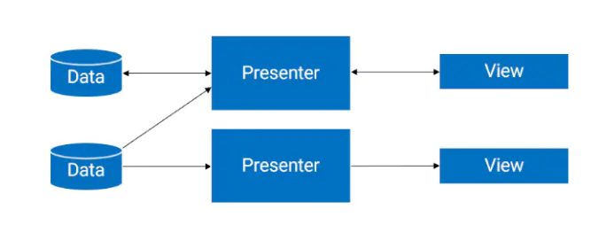
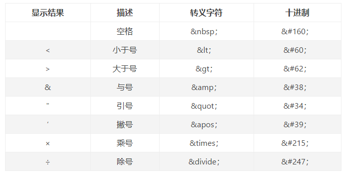

# 一、MVP

Model 应包含以下四个部分：

- VO：视图对象，封装页面中所有的数据
- DTO：数据传输对象，网络请求/IO流中
- DO：领域对象，业务实体
- PO：持久化存储的对象



MVP中，将Data和View层彻底分离，由Presenter中间层负责双方的交互通信（接口实现），Actvitiy的职责从MVC的 Controller +View 彻底解耦，变成了只需要进行控制UI的View层。Presenter中进行数据业务的分发处理，同时持有View层和Model层的接口引用。Model层完全负责数据的传输和处理工作。

**处理逻辑**：View层需要展示某些数据时，先调用Presenter层的接口引用，Presenter层再调用Model层请求数据，Model层根据情况判断，回调Presenter层的方法，通知Presenter层的数据加载情况，最后Presenter层再调用View的接口，将数据返回并展示。


- 优点：

减少了Activity的职责，耦合度更低，方便进行接口测试，模块职责划分明确。

- 缺点：

每层都需要对应的接口和类，每次改动接口代价较高。


## 1.完整版

### 实现逻辑：

View向Model层请求数据逻辑：红线线

Model层向View返回数据：蓝色线


需要注意P层的实现类中，一些接口对象的处理：

因为View层的接口实现类为Activity，且数据请求是从View层调用P层，所以在Activity中实例化时，调用P层构造时直接传入this即可。

Model层的接口实现类，需要new一个实例化对象。在调用login方法时，需要一个回调接口对象，P层实现了该接口，所以直接传入this即可。


### 具体代码：

#### 1.Model层

User类：

```java
@Data
public class User {
    String username;
    String password;
}
```

接口：

```java
public interface LoginModel {
    void login(User user, OnLoginFinishedListener listener);
}
```

接口实现：

```java
public class LoginModelImpl implements LoginModel {
    @Override
    public void login(User user, final OnLoginFinishedListener listener) {
        final String username = user.getUsername();
        final String password = user.getPassword();
        /*
        * 方便起见，这里只简单模拟，为空则登录失败，其余均成功，并模拟延时效果
        */
        new Handler().postDelayed(new Runnable() {
            boolean error = false;

            @Override
            public void run() {
                if (TextUtils.isEmpty(username)) {
                    listener.onUsernameError();
                    error = true;
                }
                if (TextUtils.isEmpty(password)) {
                    listener.onPasswordError();
                    error = true;
                }
                if (!error) {
                    listener.onSuccess();
                }
            }
        }, 1000);
    }
}

```


#### 2.Presenter层

请求接口：

```java
public interface LoginPresenter {
    void validateCredentials(User user);

    void onDestroy();
}
```

回调接口：

```java
public interface OnLoginFinishedListener {
    void onUsernameError();

    void onPasswordError();

    void onSuccess();
}
```

实现类：

```java
public class LoginPresenterImpl implements LoginPresenter, OnLoginFinishedListener {
    private LoginView loginView;
    private LoginModel loginModel;

    public LoginPresenterImpl(LoginView loginView) {
        this.loginView = loginView;	  
        this.loginModel = new LoginModelImpl();		//实例化Model层接口对象
    }

    @Override
    public void validateCredentials(User user) {
        if (loginView != null) {
            loginView.showProgress();
        }
        loginModel.login(user, this);	//因为实现了所需接口，直接传入this即可
    }

    @Override
    public void onDestroy() {
        loginView = null;
    }

    @Override
    public void onUsernameError() {
        if (loginView != null) {
            loginView.setUsernameError();
            loginView.hideProgress();
        }
    }

    @Override
    public void onPasswordError() {
        if (loginView != null) {
            loginView.setPasswordError();
            loginView.hideProgress();
        }
    }

    @Override
    public void onSuccess() {
        if (loginView != null) {
            loginView.showSuccess();
        }
    }
}
```


#### 3.View层

接口：

```java
public interface LoginView {
    void showProgress();

    void hideProgress();

    void setUsernameError();

    void setPasswordError();

    void showSuccess();
}
```

XML：省略控件宽高等非必须属性

```xml
<LinearLayout xmlns:android="http://schemas.android.com/apk/res/android"
    xmlns:tools="http://schemas.android.com/tools"
    tools:context=".View.LoginActivity">

    <EditText
        android:id="@+id/ET_username"/>

    <EditText
        android:id="@+id/ET_password"/>

    <ProgressBar
        android:id="@+id/progress" />

    <Button
        android:onClick="login"
        android:text="登录" />
</LinearLayout>
```

Actvity：

```java
public class LoginActivity extends AppCompatActivity implements LoginView {
    ProgressBar mProgressBar;
    EditText ET_username, ET_password;
    LoginPresenter mLoginPresenter;


    @Override
    protected void onCreate(Bundle savedInstanceState) {
        super.onCreate(savedInstanceState);
        setContentView(R.layout.activity_login);

        mProgressBar = findViewById(R.id.progress);
        ET_username = findViewById(R.id.ET_username);
        ET_password = findViewById(R.id.ET_password);
        mLoginPresenter = new LoginPresenterImpl(this);		//P层接口对象的实例化，实现了所需接口，直接传入this即可
        hideProgress();
    }

    @Override
    public void showProgress() {
        mProgressBar.setVisibility(View.VISIBLE);
    }

    @Override
    public void hideProgress() {
        mProgressBar.setVisibility(View.GONE);
    }

    @Override
    public void setUsernameError() {
        ET_username.setError("用户名错误");
    }

    @Override
    public void setPasswordError() {
        ET_password.setError("密码错误");
    }

    @Override
    public void showSuccess() {
        hideProgress();
        startActivity(new Intent(this, MainActivity.class));
        Toast.makeText(this, "登录成功", Toast.LENGTH_SHORT).show();
    }

    public void login(View view) {
        //封装，调用接口请求Model层数据验证
        User user = new User();
        user.setUsername(ET_username.getText().toString());
        user.setPassword(ET_password.getText().toString());
        mLoginPresenter.validateCredentials(user);
    }
}
```

最后别忘了在把LoginActivity设置为起始界面，MA中没改动。


## 2.简化版

因完整版需要创建大量的接口，在项目较为简单时，可以使用该简化版本


### 1.唯一接口：

用于校验数据的返回正确与否

```java
public interface OnFinishedListener {
    void onFailure(String msg);

    void onSuccess();
}
```


### 2.Model层

只用来存放bean对象

```java
@Data
public class User {
    String username;
    String password;
}
```


### 3.Presenter

充当Model进行网络请求和数据验证工作

```java
public class LoginPresent {
    public void Login(final User user, final OnFinishedListener listener) {
        /*
         * 方便起见，这里只简单模拟，为空则登录失败，其余均成功，并模拟延时效果
         */
        new Handler().postDelayed(new Runnable() {
            boolean error = false;

            @Override
            public void run() {
                if (TextUtils.isEmpty(user.getUsername())) {
                    listener.onFailure("用户名错误");
                    error = true;
                }
                if (TextUtils.isEmpty(user.getPassword())) {
                    listener.onFailure("密码");
                    error = true;
                }
                if (!error) {
                    listener.onSuccess();
                }
            }
        }, 1000);
    }
}
```


### 4.View层

```java
    LoginPresent mLoginPresent;
    ProgressBar mProgressBar;
    EditText ET_username, ET_password;

    @Override
    protected void onCreate(Bundle savedInstanceState) {
        super.onCreate(savedInstanceState);
        setContentView(R.layout.activity_main);
        //findview
        ET_username = findViewById(R.id.ET_username);
        ET_password = findViewById(R.id.ET_password);
        mProgressBar = findViewById(R.id.progress);
        //实例化了P层对象
        mLoginPresent = new LoginPresent();
    }

    public void login(View view) {
        //封装，调用接口请求Model层数据验证
        User user = new User();
        user.setUsername(ET_username.getText().toString());
        user.setPassword(ET_password.getText().toString());
        //调用UI
        mProgressBar.setVisibility(View.VISIBLE);

        mLoginPresent.Login(user, new OnFinishedListener() {
            @Override
            public void onFailure(String msg) {
                if (msg.equals("用户名错误")) {
                    ET_username.setError("用户名错误");
                    mProgressBar.setVisibility(View.GONE);
                } else {
                    ET_password.setError("密码错误");
                    mProgressBar.setVisibility(View.GONE);
                }
            }

            @Override
            public void onSuccess() {
                mProgressBar.setVisibility(View.GONE);
              	//执行界面的跳转
                startActivity(new Intent(MainActivity.this, Main2Activity.class));
                Toast.makeText(MainActivity.this, "登录成功", Toast.LENGTH_SHORT).show();
            }
        });
    }
```


# 二、MVVM

- V层：只做和UI相关的事，初始化控件，改变控件的颜色等
- VM层：只做和业务逻辑相关的事，不持有任何控件的引用
- M层：基本就是Bean，也包括Retrofit和Service等


重点来说VM层，VM层一般包括下面几个部分：

- Model	（Bean）
- DataField	（数据绑定，liveData）
- Command	（命令绑定，对事件的处理，包括下拉刷新，加载更多等）
- ChildViewModel 	（子VM，例如Actvity当中包含了Fragment，二者都持有VM）


## 1.DataBinding

### 1.1 DataBingding初始化

对应模块的Build.gradle中加入：

```java
android {
  	//……
    dataBinding {
        enabled = true
    }
}
```


### 1.2 基本使用

新建bean对象

```java
@Data
public class User {
    private String username;
  
    public User(String username) {
        this.username = username;
    }
}
```

布局文件：

```xml
<?xml version="1.0" encoding="utf-8"?>
<layout xmlns:android="http://schemas.android.com/apk/res/android"
    xmlns:app="http://schemas.android.com/apk/res-auto"
    xmlns:tools="http://schemas.android.com/tools">

    <data>
        <variable
            name="user"
            type="com.example.test_demo2.bean.User" />
    </data>

    <LinearLayout
        android:layout_width="match_parent"
        android:layout_height="match_parent"
        android:orientation="vertical"
        tools:context=".MainActivity">
      
        <TextView
            android:layout_width="wrap_content"
            android:layout_height="wrap_content"
            android:text="@{user.username}" />
    </LinearLayout>
</layout>
```

MA：

```java
public class MainActivity extends AppCompatActivity {

    @Override
    protected void onCreate(Bundle savedInstanceState) {
        super.onCreate(savedInstanceState);
        //获取布局的方式要改变
        ActivityMainBinding activityMainBinding = DataBindingUtil.setContentView(this, R.layout.activity_main);
        //给布局中的User设置对象
        activityMainBinding.setUser(new User("张三"));
    }
}
```


### 1.3 布局中支持的运算符

| 描述         | 符号                            |
| ------------ | ------------------------------- |
| 数学计算     | +    -    /    *    %           |
| 字符串连接   | +                               |
| 逻辑         | &&    \|\|                      |
| 二进制位运算 | &        \|       ^             |
| 一元         | +     -      !      ~           |
| 位移         | >>   >>>    <<                  |
| 比较         | ==     >    <     >=     <=     |
| 向下转型     | instanceof                      |
| 组           | ()                              |
| 三元运算符   | ?：                             |
| 其他         | 数组[] ，函数调用，类型转换等等 |


#### 1.三目运算符

username不存在，则展示1

```java
 android:text="@{user.username??`1`}" 
```


#### 2.字符拼接

```java
android:text="@{`username is:`+user.username}"
```


#### 3.转义字符

```java
android:background="@{user.username.length &lt; 1? 0xFF0000FF:0xFFFF0000}"
```


##### 补充：常用转译表和支持的表达式



不支持的：

this  super  new   <T>（不转译的显式泛型）


 


### 1.4.获取其中的控件

所有带有ID的控件，都会在binding对象中生成一个带有 对应ID的 public final View ，且效率高于findViewById

```xml
        <!--注意，如果这里用了data域中的值，则优先显示data域的值，哪怕data域的值为空-->
        <TextView
            android:id="@+id/txt"
            android:layout_width="wrap_content"
            android:layout_height="wrap_content"/>
```

```java
 activityMainBinding.txt.setText("设置字体");
```


### 1.5 绑定图片

bean对象增加图片属性

```java
@Data
public class User {
    private String username;
    private String userface;


    public User() {
    }

    public User(String username, String userface) {
        this.username = username;
        this.userface = userface;
    }

  	//该方法表示用户在imageView中使用自定义属性userface时，触发该方法
    //注意：此方法必须为静态，且第一个参数为View的子类对象
    @BindingAdapter("bind:userface")
    public static void getInternetImage(ImageView imageView, String userface) {
        Glide.with(imageView.getContext()).load(userface).into(imageView);
    }
}
```

> 该注解可以使用  value=["value1","value2"]  的形式，标记多个名称，并且如果定义了 requireAll = true 属性，使用时必须同时使用两个，不然报错


xml新增一个IV显示图片

```xml
   <!--userface对应上面注解的方法，前缀为app-->
	<ImageView
      android:id="@+id/iv"
      android:layout_width="wrap_content"
      android:layout_height="wrap_content"
      app:userface="@{user.userface}" /> 
```

MA设置属性：

```java
public class MainActivity extends AppCompatActivity {

    @Override
    protected void onCreate(Bundle savedInstanceState) {
        super.onCreate(savedInstanceState);
        //获取布局的方式要改变
        ActivityMainBinding activityMainBinding = DataBindingUtil.setContentView(this, R.layout.activity_main);
        //给布局中的User设置对象
        activityMainBinding.setUser(new User("张三", "http://img2.cache.netease.com/auto/2016/7/28/201607282215432cd8a.jpg"));
    }
}
```


### 1.6 绑定数组和集合

```xml
<layout xmlns:android="http://schemas.android.com/apk/res/android">

    <data>
        <!--如果这里import了对应的类，下面的type就可以直接写最后的类名
			如果最后的类名重名了，可以使用 alias属性 起别名-->
        <import type="java.util.List" />
        <import type="java.util.Map" />

        <!--特殊字符需要通过转义字符才行，如：<用&lt;表示   >用&gt;表示    -->
        <variable
            name="list"
            type="List&lt;String&gt;" />

        <variable
            name="map"
            type="Map&lt;String,Object&gt;" />

        <variable
            name="array"
            type="String[]" />
    </data>

    <LinearLayout
        android:orientation="vertical">

        <TextView
            android:text="@{list[0]}" />

        <TextView
            android:text="@{list.get(1)}" />

        <!--这里的text中如果外面用了双引，key就用1左边那个点-->
        <TextView
            android:text="@{map[`key0`]}" />

				<!--外面用了单引，key就用双引-->
        <TextView
            android:text='@{map.get("key1")}' />
        
        <TextView
            android:layout_marginTop="10dp"
            android:text="@{array[0]}" />

        <TextView
            android:text="@{array[1]}" />
    </LinearLayout>
</layout>
```

MA中做同样的处理：

```java
	ActivityMain2Binding binding = DataBindingUtil.setContentView(this, R.layout.activity_main2);
    List<String> list = new ArrayList<>();
    list.add("list1");
    list.add("list2");
    binding.setList(list); 

    HashMap<String, Object> map = new HashMap<>();
    map.put("key0", "map_value0");
    map.put("key1", "map_value1");
    binding.setMap(map);	

    String[] arrays = {"字符串1", "字符串2"};
    binding.setArray(arrays); 
```


### 1.7 RecyclerView中的使用

先创建子项的布局文件 item_user.xml ，稍后创建出来的DataBinding类就是 ItemUserDataBingding：

```xml
<layout xmlns:android="http://schemas.android.com/apk/res/android"
    xmlns:app="http://schemas.android.com/apk/res-auto">

    <data>

        <variable
            name="user"
            type="com.example.test_demo2.bean.User" />

        <variable
            name="click"
            type="android.view.View.OnClickListener" />
    </data>

    <LinearLayout
        android:layout_width="match_parent"
        android:layout_height="wrap_content"
        android:orientation="horizontal">

        <TextView
            android:id="@+id/item_name"
            android:layout_width="wrap_content"
            android:layout_height="wrap_content"
            android:onClick="@{click}"
            android:text="@{user.username}" />

        <ImageView
            android:id="@+id/item_iv"
            android:layout_width="50dp"
            android:layout_height="50dp"
            android:onClick="@{click}"
            app:userface="@{user.userface}" />
    </LinearLayout>
</layout>
```

User类在上面已经创建好了，直接编写UserAdapter：

```java
package com.example.test_demo2.adpter;

import android.content.Context;
import android.view.LayoutInflater;
import android.view.View;
import android.view.ViewGroup;
import android.widget.Toast;

import androidx.databinding.DataBindingUtil;
import androidx.recyclerview.widget.RecyclerView;

import com.example.test_demo2.R;
import com.example.test_demo2.bean.User;
import com.example.test_demo2.databinding.ItemUserBinding;

import java.util.List;

public class UserAdapter extends RecyclerView.Adapter<UserAdapter.ViewHolder> {
    private List<User> mUserList;
    private Context mContext;

    public UserAdapter(Context context, List<User> userList) {
        mContext = context;
        mUserList = userList;
    }

    @Override
    public ViewHolder onCreateViewHolder(ViewGroup parent, int viewType) {
        //先根据布局创建Bingding对象，注意，使用的函数为inflate()
        ItemUserBinding binding = DataBindingUtil.inflate(LayoutInflater.from(parent.getContext()), R.layout.item_user, parent, false);
        return new ViewHolder(binding);
    }

    @Override
    public void onBindViewHolder(final ViewHolder holder, int position) {
        User user = mUserList.get(position);
        holder.binding.setUser(user);
        // holder.binding.executePendingBindings();//如果下拉刷新数据闪烁，使用该行代码

        //设置binding中的点击监听
        holder.binding.setClick(new View.OnClickListener() {
            @Override
            public void onClick(View view) {
                //获取到对应位置的user对象
                int position = holder.getAdapterPosition();
                User user = mUserList.get(position);
                switch (view.getId()) {
                    case R.id.item_name:
                        Toast.makeText(mContext, "点击了" + user.getUsername(), Toast.LENGTH_SHORT).show();
                        break;
                    case R.id.item_iv:
                        Toast.makeText(mContext, "点击了图片" +user.getUserface(), Toast.LENGTH_SHORT).show();
                        break;
                }
            }
        });
    }

    @Override
    public int getItemCount() {
        return mUserList.size();
    }

    //只需要一个ViewDataBinding的实例对象，因为所有控件都绑定在了Binding对象中
    //ItemUserBinding类是因为编写了对应的item_user.xml生成的
    class ViewHolder extends RecyclerView.ViewHolder {
        ItemUserBinding binding;

        public ViewHolder(ItemUserBinding binding) {
            super(binding.getRoot());
            this.binding = binding;
        }
    }
}
```


MA和XML：

```xml
<?xml version="1.0" encoding="utf-8"?>
<layout xmlns:android="http://schemas.android.com/apk/res/android"
    xmlns:tools="http://schemas.android.com/tools">

    <data>

    </data>

    <RelativeLayout
        android:layout_width="match_parent"
        android:layout_height="match_parent"
        tools:context=".MainActivity">

        <androidx.recyclerview.widget.RecyclerView
            android:id="@+id/rv"
            android:layout_width="match_parent"
            android:layout_height="match_parent" />
    </RelativeLayout>
</layout>

```

```java
public class MainActivity extends AppCompatActivity {

    ActivityMainBinding activityMainBinding;

    @Override
    protected void onCreate(Bundle savedInstanceState) {
        super.onCreate(savedInstanceState);
        //获取布局的方式要改变
        activityMainBinding = DataBindingUtil.setContentView(this, R.layout.activity_main);

        //设置加载的数组对象
        User user1 = new User("张三", "http://img2.cache.netease.com/auto/2016/7/28/201607282215432cd8a.jpg");
        User user2 = new User("李四", "http://img2.cache.netease.com/auto/2016/7/28/201607282215432cd8a.jpg");
        ArrayList<User> userArrayList = new ArrayList<>();
        userArrayList.add(user1);
        userArrayList.add(user2);

        //设置
        activityMainBinding.rv.setLayoutManager(new LinearLayoutManager(this));
        activityMainBinding.rv.setAdapter(new UserAdapter(this, userArrayList));
    }
}
```


### 1.8 优雅的点击事件

拿上述的RV中的例子说明：

在bean中创建点击事件的方法

```java
    public void onItemClick(View view) {
        Toast.makeText(view.getContext(), "你点了子项", Toast.LENGTH_SHORT).show();
    }
```

user_item的子项申明：

```java
   <LinearLayout
        android:layout_width="match_parent"
        android:layout_height="wrap_content"
        android:onClick="@{user.onItemClick}"
        android:orientation="horizontal">
```


### 1.9 Fragment中的使用

```java
  @Override
    public View onCreateView(LayoutInflater inflater, ViewGroup container, Bundle savedInstanceState) {
      	//使用 inflate 关联布局，返回为 bingding.getRoot()
        FragmentFirstBinding binding = DataBindingUtil.inflate(inflater, R.layout.fragment_first, container, false);
        binding.setTxt("hello");
        return binding.getRoot();
    }
```


### 1.10 数据更新和双向绑定

数据实时根据User类发生变化，有两种方法


#### 数据更新

##### 1.BaseObservable

类似于RV中的 notifyDataSetChanged(); 函数，将 JavaBean 类继承自 BaseObervable ，使用注解和函数 完成该刷新动作

```java
public class User extends BaseObservable {
    private String username;
    private String userface;

  	//省略构造和其他无关的方法

    @Bindable	//注解绑定get方法
    public String getUsername() {
        return username;
    }

    public void setUsername(String username) {
        this.username = username;
        notifyPropertyChanged(BR.username);	//监听的属性值，BR自动生成的
    }

    @Bindable
    public String getUserface() {
        return userface;
    }

    public void setUserface(String userface) {
        this.userface = userface;
        notifyPropertyChanged(BR.userface);
    }
}
```


##### 2.ObservableFields

有一系列的派生对象，如`ObservableField<String>`  、`ObservableInt` 、`ObservableArrayList `、`ObservableArrayMap `等等

使用和普通的对象基本相同，要注意下它的get/set方法有些差异，如果用pulic可以直接`.username.set()`，更加方便

```java
public class User {
    //public是为了方便获取，就可以省略繁琐的get/set方法
     public ObservableField<String> username = new ObservableField<>();
     ObservableField<String> userface = new ObservableField<>();

    public User(String username, String userface) {
        this.username.set(username);
        this.userface.set(userface);
    }

    //这里不能设置为String，否则无法改变
    public ObservableField<String> getUserface() {
        return userface;
    }

    public void setUserface(String userface) {
        this.userface.set(userface);
    }

   
}
```

```java
User1 zhangsan;
zhangsan = new User1(new ObservableField<String>("张三"),new ObservableInt(18));

zhangsan.name.set("李四");//赋值语句

zhangsan.name.get() //取值语句
```


#### 双向绑定：

在XML中加入一个EditText，根据EdtiText实时更变User.name

```xml
  <EditText
      android:id="@+id/et_username"
      android:layout_width="match_parent"
      android:layout_height="wrap_content"
      android:text="@={user.username}" />  <!--只需要在这里加一个等号-->
```


## 2.LiveData

LiveData是一种类，持有可被观察的数据。它是一种可感知生命周期的组件，该组件能确保，仅仅在组件处于活跃的生命周期状态的时候，才去更新APP组件【活跃状态就是指处于STARTED或者RESUMED状态】。在对应的Lifecycle Object处于销毁状态时，会自动解除LiveData和该观察者的注册关系。所以Activity、Fragment不用担心会出现内存泄露。

所以该组件需要配合LifeCycle的使用


优势：

* 确保UI和数据状态相符，在屏幕切换等Configuration改变时，也能保证数据最新
* 不会给已停止的Activity发送事件，没有内存泄漏
* 不再需要手工对生命周期处理
* 共享资源


LiveData和ObservableFields的作用大致相同，都是定义了一个观察者变量，达到数据更新的作用。LiveData可以脱离JavaBean对象使用。


不同的是：

1. ObservableFields只有在数据发生变化时，UI才会收到通知，LiveData只要postValue或setValue，UI就会收到通知
2. LiveData不会监测不活跃的APP组件
3. LiveData将数据定义在了VM层

> setValue用在主线程，postValue都行


### 2.1 引入依赖

```
    implementation 'androidx.lifecycle:lifecycle-extensions:2.2.0'
```


### 2.2 基本使用

```java
public class NameViewModel extends ViewModel {	//继承VM
    private MutableLiveData<String> currentName;
  
    //因为用postValue改变值，所以只需要一个get方法
    public MutableLiveData<String> getCurrentName() {
        if (currentName == null) {
            currentName = new MutableLiveData<String>();
        }
        return currentName;
    }
}
```


### 2.3 创建观察者对象

这里以Fragment为演示，更新VM中的数据

layout_Livedata.xml：

```xml
<?xml version="1.0" encoding="utf-8"?>
<layout xmlns:android="http://schemas.android.com/apk/res/android"
    xmlns:tools="http://schemas.android.com/tools">

    <data>
        <variable
            name="vm"
            type="com.example.test_demo2.vm.NameViewModel" />
    </data>

    <LinearLayout
        android:layout_width="match_parent"
        android:layout_height="match_parent"
        android:orientation="vertical"
        tools:context=".MainActivity">

        <TextView
            android:layout_width="wrap_content"
            android:layout_height="wrap_content"
            android:text="@{vm.currentName}" />

        <Button
            android:id="@+id/change"
            android:layout_width="wrap_content"
            android:layout_height="wrap_content"
            android:text="改变" />
    </LinearLayout>
</layout>
```

```java
public class MainActivity extends AppCompatActivity {
    ActivityMainBinding activityMainBinding;
    NameViewModel nameViewModel;

    @Override
    protected void onCreate(Bundle savedInstanceState) {
        super.onCreate(savedInstanceState);
        activityMainBinding = DataBindingUtil.setContentView(this, R.layout.activity_main);

      	//VM对象
        nameViewModel = ViewModelProviders.of(this).get(NameViewModel.class);
        //新建一个观察者对象
        nameViewModel.getCurrentName().observe(this, new Observer<String>() {
            @Override
            public void onChanged(String s) {
                //当数据变化的时候
                activityMainBinding.setVm(nameViewModel);
            }
        });

        activityMainBinding.change.setOnClickListener(v -> {
            nameViewModel.getCurrentName().setValue("王五");
        });
    }
}
```


## 3.实战演示

DataBinding + LiveData + ViewModel +LifeCycle


最终效果：使用MVVM模式，模拟网络请求，加载数据进RecyclerView


### 1.bean对象

```java
@Data
public class Person {
    String name;
    int age;
}
```


### 2.适配器和布局

```xml
<layout xmlns:android="http://schemas.android.com/apk/res/android">

    <data>
        <variable
            name="person"
            type="com.example.test_databinding.Person" />
    </data>

    <LinearLayout
        android:layout_width="match_parent"
        android:layout_height="wrap_content"
        android:orientation="horizontal">

        <TextView
            android:id="@+id/item_name"
            android:layout_width="wrap_content"
            android:layout_height="50dp"
            android:text="@{person.name}" />

        <TextView
            android:id="@+id/item_age"
            android:layout_width="wrap_content"
            android:layout_height="50dp"
            android:text="@{String.valueOf(person.age)}" />
    </LinearLayout>
</layout>
```


```java
public class PersonAdapter extends RecyclerView.Adapter<PersonAdapter.ViewHolder> {
    private List<Person> mPersonList;
    private Context mContext;

    public PersonAdapter(Context context, List<Person> personList) {
        mContext = context;
        mPersonList = personList;
    }

    @Override
    public ViewHolder onCreateViewHolder(ViewGroup parent, int viewType) {
        ItemPersonBinding binding = DataBindingUtil.inflate(LayoutInflater.from(parent.getContext()), R.layout.item_person, parent, false);
        return new ViewHolder(binding);
    }

    @Override
    public void onBindViewHolder(final ViewHolder holder, int position) {
        Person person = mPersonList.get(position);
        holder.binding.setPerson(person);
    }

    @Override
    public int getItemCount() {
        return mPersonList.size();
    }
    
    class ViewHolder extends RecyclerView.ViewHolder {
        ItemPersonBinding binding;

        public ViewHolder(ItemPersonBinding binding) {
            super(binding.getRoot());
            this.binding = binding;
        }
    }

    public void updateData(List datas) {
        if (datas == null) {
            datas = new ArrayList();
        }
        mPersonList = datas;
        notifyDataSetChanged();
    }
}
```


### 3.VM层

```java
public class PersonVM extends ViewModel {
    public MutableLiveData<List<Person>> persons;
    public MutableLiveData<Boolean> noData;

    public PersonVM init() {
        if (persons == null) {
            persons = new MutableLiveData<>();
            persons.setValue(new ArrayList<>());
        }
        if (noData == null) {
            noData = new MutableLiveData<>();
            noData.setValue(true);
        }
        return this;
    }

  //模拟请求数据
    public void requestList() {
        ArrayList arrayList = new ArrayList();
        arrayList.add(new Person("张三" + System.currentTimeMillis(), 18));
        arrayList.add(new Person("李四" + System.currentTimeMillis(), 20));
        arrayList.add(new Person("往往i" + System.currentTimeMillis(), 22));
        arrayList.add(new Person("赵六" + System.currentTimeMillis(), 19));
        persons.setValue(arrayList);
    }

  //清空数组
    public void clear() {
        persons.setValue(new ArrayList<>());
    }
}
```


### 4.MA和布局

```xml
<?xml version="1.0" encoding="utf-8"?>
<layout xmlns:android="http://schemas.android.com/apk/res/android"
    xmlns:tools="http://schemas.android.com/tools">

    <data>

        <import type="android.view.View" />

        <variable
            name="vm"
            type="com.example.test_databinding.PersonVM" />

    </data>

    <LinearLayout
        android:layout_width="match_parent"
        android:layout_height="match_parent"
        android:orientation="vertical"
        tools:context=".MainActivity">

        <Button
            android:id="@+id/BtnGetList"
            android:layout_width="wrap_content"
            android:layout_height="wrap_content"
            android:onClick="@{()->vm.requestList()}"
            android:text="getList" />


        <Button
            android:id="@+id/BtnClear"
            android:layout_width="wrap_content"
            android:layout_height="wrap_content"
            android:onClick="@{()->vm.clear()}"
            android:text="clear" />

        <androidx.recyclerview.widget.RecyclerView
            android:id="@+id/rv"
            android:layout_width="match_parent"
            android:layout_height="wrap_content" />

        <TextView
            android:id="@+id/emptyView"
            android:layout_width="wrap_content"
            android:layout_height="wrap_content"
            android:text="暂无数据"
            android:visibility="@{vm.nodata ? View.VISIBLE : View.GONE}" />
    </LinearLayout>
</layout>
```


```java
public class MainActivity extends AppCompatActivity {
    ActivityMainBinding mBinding;

    @Override
    protected void onCreate(Bundle savedInstanceState) {
        super.onCreate(savedInstanceState);
        //构建Binding
        mBinding = DataBindingUtil.setContentView(this, R.layout.activity_main);
        mBinding.setLifecycleOwner(this);

        //构建VM，并绑定当前活动，调用初始化方法。
        // 如果是多个碎片处于同一个活动，context为getActivity，则vm数据可以实现共享
        PersonVM vm = ViewModelProviders.of(this).get(PersonVM.class).init();
        mBinding.setVm(vm);

        //设置RV，vm.persons.getValue()拿到List数据
        mBinding.rv.setLayoutManager(new LinearLayoutManager(this));
        PersonAdapter adapter = new PersonAdapter(this, vm.persons.getValue());
        mBinding.rv.setAdapter(adapter);

        //监测VM中的List变化，并作出响应
        vm.persons.observe(this, list -> {
            if (list == null || list.size() == 0) {
                vm.nodata.setValue(true);
            } else {
                vm.nodata.setValue(false);
            }
            adapter.updateData(list);
        });
    }
}
```


## 4.VM访问系统资源

因为VM不持有Context的引用，所以无法访问如SP等地方的文件。所以可以继承自`AndroidViewModel`。

```java
public class PersonVM extends AndroidViewModel {

  	//继承后需提供一个构造方法，还可以有BundleSaveInstance形参
    public PersonVM(@NonNull Application application) {
        super(application);
    }

  	//继承后就可以使用getApplication()访问Context变量
    public void save() {
        SharedPreferences sp = getApplication().getSharedPreferences("a", Context.MODE_PRIVATE);
        SharedPreferences.Editor editor = sp.edit();
        editor.putInt("1", 1);
        editor.apply();
    }
}
```


