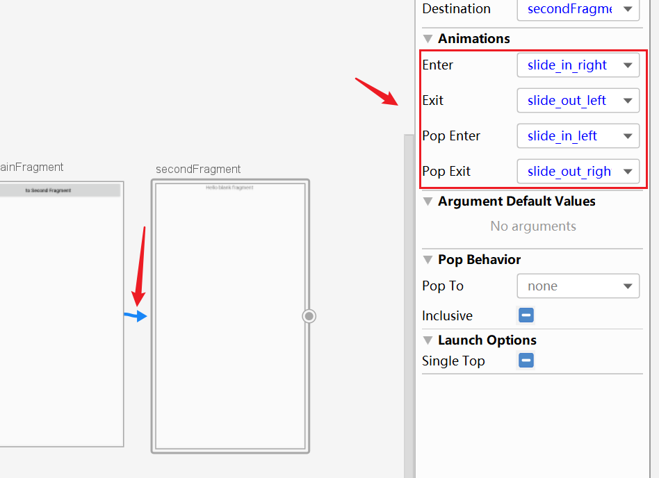

# 一、Navigation


## 1.主要元素

1.Navigation Graph 新型的XML资源文件，包含所有界面和界面之间的关系

2.NavHostFragment 特殊的Fragment，是其他Fragment的容器，进行Fragment的展示

3.NavController，用于在代码中完成Navigation Graph的切换工作


当你想切换Fragment时，使用NavController对象，告诉它你想去Navigation Graph中的哪一个fragment，然后NavController将该fragment展示在NavHostFragment 中。


会提示需要添加依赖，也可以手动添加：

```
    implementation 'androidx.navigation:navigation-fragment-ktx:2.0.0'
    implementation 'androidx.navigation:navigation-ui-ktx:2.0.0'
```


## 2.页面的切换

MA的布局中引入，也可直接拖动 containers 中的 NavHostFragment：

```xml
    <fragment
        android:id="@+id/nav_host_fragment"
        android:name="androidx.navigation.fragment.NavHostFragment"
        android:layout_width="match_parent"
        android:layout_height="match_parent"
        app:defaultNavHost="true"
        app:navGraph="@navigation/nav_graph" />

	<!-- android:name 告诉系统这是一个特殊的fragment-->
	<!-- app:defaultNavHost 自动处理系统的返回键-->
	<!-- app:navGraph 设置该fragment的导航图-->
```


到 nav_graph.xml 中：


然后创建好我们所需的fragment页面，左边就会出现fragment的列表，start表示起始界面


查看Text文本：

```xml
<navigation xmlns:android="http://schemas.android.com/apk/res/android"
    xmlns:app="http://schemas.android.com/apk/res-auto"
    xmlns:tools="http://schemas.android.com/tools"
    android:id="@+id/nav_graph"
    app:startDestination="@id/mainFragment">
    
<!--  app:startDestination 指向mainFragment-->
    
    <fragment
        android:id="@+id/mainFragment"
        android:name="com.example.navigationtest.MainFragment"
        android:label="fragment_main"
        tools:layout="@layout/fragment_main" />
</navigation>
```


再创建一个SecondFragment，然后让 mainFragment 指向 secondFragment


查看xml代码，mainfragment中多了一段代码：

```xml
        <action
            android:id="@+id/action_mainFragment_to_secondFragment"
            app:destination="@id/secondFragment" />
```


此时，在MainFragment中设置如下代码：

```java
    @Override
    public View onCreateView(LayoutInflater inflater, ViewGroup container,
                             Bundle savedInstanceState) {
        View view = inflater.inflate(R.layout.fragment_main, container, false);
        view.findViewById(R.id.btn_toSecondFragment).setOnClickListener(v -> {
            Navigation.findNavController(v).navigate(R.id.action_mainFragment_to_secondFragment);
//            Navigation.createNavigateOnClickListener(R.id.action_mainFragment_to_secondFragment);
        });
        return view;
    }
```

> 两种方法都行，id就是上面的action标签中的id


## 3.动画

添加所需动画，点击箭头即可设置：




xml代码中添加了如下代码：

```java
     <action
            android:id="@+id/action_mainFragment_to_secondFragment"
            app:destination="@id/secondFragment"
            app:enterAnim="@anim/slide_in_right"
            app:exitAnim="@anim/slide_out_left"
            app:popEnterAnim="@anim/slide_in_left"
            app:popExitAnim="@anim/slide_out_right" />
```


## 4.传递参数

### 1.传统的Bundle


```java
Bundle bundle=new Bundle();
bundle.putString("username","zhangsan");       Navigation.findNavController(v).navigate(R.id.action_mainFragment_to_secondFragment,bundle);
```


```java
        Bundle bundle = getArguments();
        if (bundle != null) {
            String username = bundle.getString("username");
            TextView tv_name = view.findViewById(R.id.tv_name);
            tv_name.setText(username);
        }
```


### 2.safe args

优点：

使用get、set的方式传递参数，更加安全、直观


项目的gradle中引入依赖：

```java
classpath 'androidx.navigation:navigation-safe-args-gradle-plugin:2.0.0'
```


app的build.gradle中：

```java
apply plugin: 'androidx.navigation.safeargs'
```


nav_graph.xml中添加：

```xml
    <fragment
        android:id="@+id/mainFragment"
        android:name="com.example.navigationtest.MainFragment"
        android:label="fragment_main"
        tools:layout="@layout/fragment_main">
        <action
            android:id="@+id/action_mainFragment_to_secondFragment"
            app:destination="@id/secondFragment"
            app:enterAnim="@anim/slide_in_right"
            app:exitAnim="@anim/slide_out_left"
            app:popEnterAnim="@anim/slide_in_left"
            app:popExitAnim="@anim/slide_out_right" />
        
		<!-- 添加argument标签  app:argType全部使用装箱类，首字母小写-->
        <argument
            android:name="username"
            android:defaultValue="unknow"
            app:argType="string" />
    </fragment>
```


发送：

```java
Bundle bundle=new MainFragmentArgs.Builder()
                    .setUsername("zhangsan")
                    .build()
                    .toBundle();
           Navigation.findNavController(v).navigate(R.id.action_mainFragment_to_secondFragment,bundle);
```


接收：

```java
Bundle bundle = getArguments();
   if (bundle != null) {
       String username = MainFragmentArgs.fromBundle(getArguments()).getUsername();
   }
```


