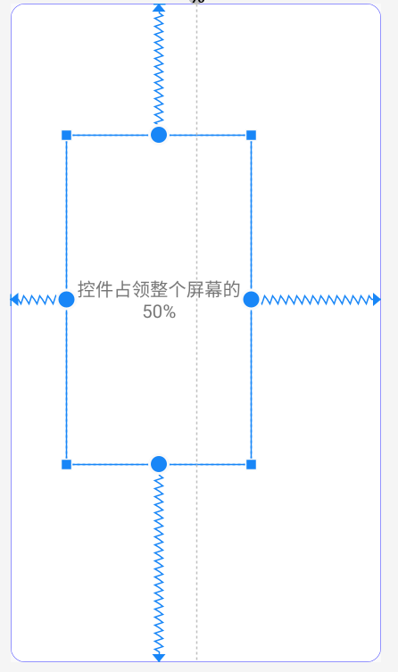
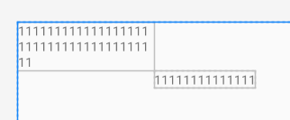
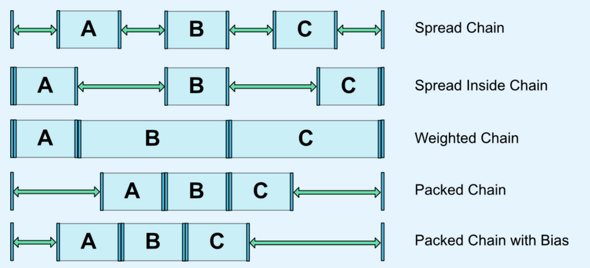
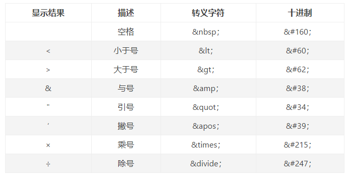
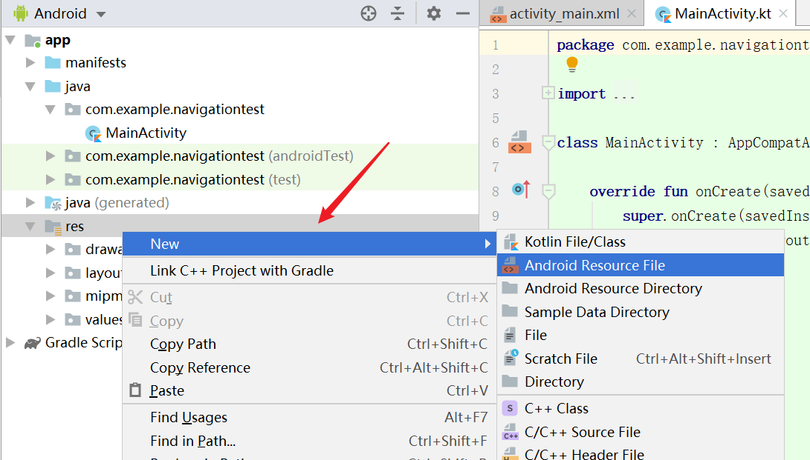
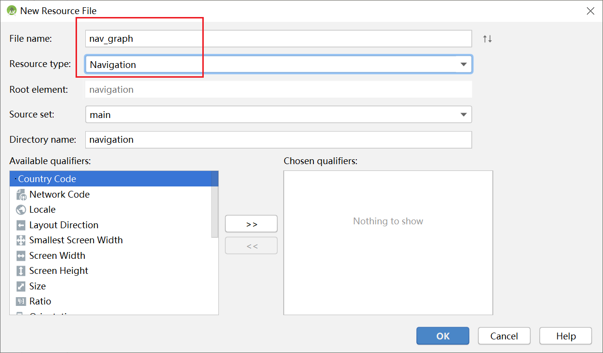
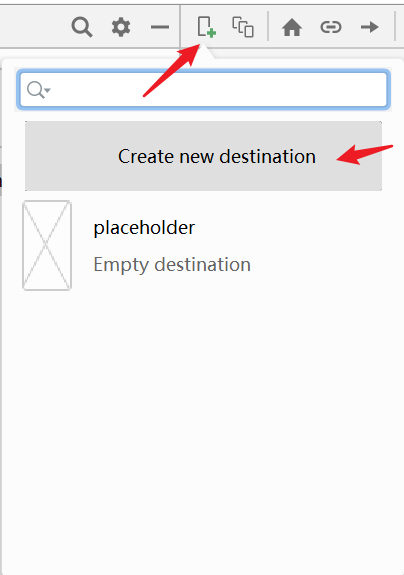
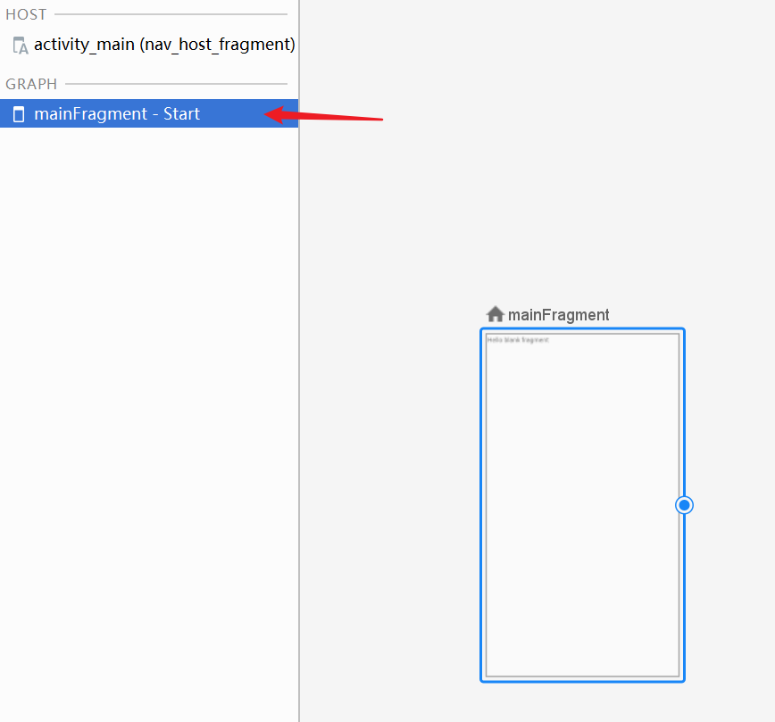
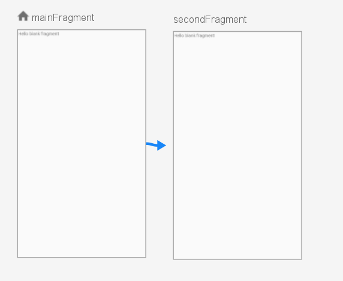
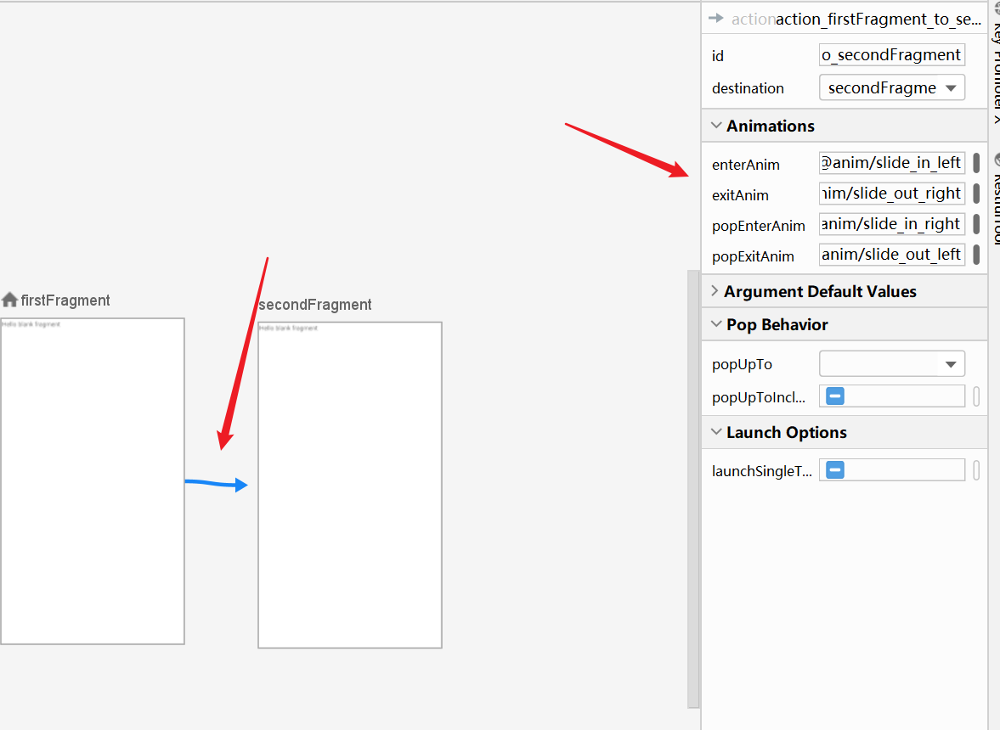

# 零、Constraintlayout

用视图界面作比例基本能满足大部分的要求，但还需要对控件属性有一些基本的认知


```xml
  <TextView
        android:id="@+id/main_tv_print_get_res"
        android:layout_width="wrap_content"
        android:layout_height="wrap_content"
        android:text="hello world"
        app:layout_constraintLeft_toLeftOf="parent"
        app:layout_constraintRight_toRightOf="parent"
        app:layout_constraintTop_toTopOf="parent" />
```

app:layout_constraintLeft_toLeftOf="parent"

当这个属性只存在一个的时候，代表控件的左边和谁对其

当 app:layout_constraintRight_toRightOf="parent" 出现时，代表控件处于二者连线居中的位置


## 特殊属性


### 1.控件所占百分比：

在控件的宽高为0dp时，起到最佳效果作用

```xml
 <TextView
        android:id="@+id/main_tv_print_get_res"
        android:layout_width="0dp"
        android:layout_height="0dp"
        android:gravity="center"
        android:text="控件占领整个屏幕的50%"		
        android:textSize="20sp"
        app:layout_constraintHeight_percent="0.5"	//高度50%
        app:layout_constraintWidth_percent="0.5"	//宽度50%
        app:layout_constraintLeft_toLeftOf="parent"	
        app:layout_constraintTop_toTopOf="parent"/>
```

效果：紧贴左上角，控件大小为整个屏幕的1/4


### 2.控件的百分比定位：

如水平方向的百分比定位，一定要在==控件左右约束都确定==的情况下才发挥作用

```xml
 <TextView
        android:id="@+id/main_tv_print_get_res"
        android:layout_width="0dp"
        android:layout_height="0dp"
        android:gravity="center"
        android:text="控件占领整个屏幕的50%"
        android:textSize="20sp"
        app:layout_constraintHorizontal_bias="0.3"		//关键代码，水平方向的定位
        app:layout_constraintVertical_bias="0.4"		//关键代码，垂直方向的定位
        app:layout_constraintHeight_percent="0.5"
        app:layout_constraintWidth_percent="0.5"
        app:layout_constraintLeft_toLeftOf="parent"
        app:layout_constraintRight_toRightOf="parent"	//补充右侧的约束
        app:layout_constraintTop_toTopOf="parent"
        app:layout_constraintBottom_toBottomOf="parent"	//补充底部的约束/>
```



控件的中心位置位于水平方向的30%，垂直方向的中心位于整体布局的40%处


### 3.权重

分为水平和竖直方向，均有约束时起作用

```xml
<Button
    android:id="@+id/btn1"
    android:layout_width="0dp"
    android:layout_height="wrap_content"
    android:text="hello world"
    app:layout_constraintHorizontal_weight="1"	//关键代码
    app:layout_constraintLeft_toLeftOf="parent"
    app:layout_constraintRight_toRightOf="parent"
    app:layout_constraintTop_toTopOf="parent" />
```


这样表示在水平方向上两个按钮以2：1分配

```xml
<Button
    android:id="@+id/btn1"
    android:layout_width="0dp"
    android:layout_height="wrap_content"
    android:text="hello world"
    app:layout_constraintHorizontal_weight="2"
    app:layout_constraintEnd_toStartOf="@id/btn2"
    app:layout_constraintStart_toStartOf="parent"
    app:layout_constraintTop_toTopOf="parent"/>

<Button
    android:id="@+id/btn2"
    android:layout_width="0dp"
    android:layout_height="wrap_content"
    android:text="hello world1"
    app:layout_constraintHorizontal_weight="1"
    app:layout_constraintEnd_toEndOf="parent"
    app:layout_constraintStart_toEndOf="@id/btn1"
    app:layout_constraintTop_toTopOf="parent"/>
```


### 4.宽高比

```xml
	<ImageView
        android:layout_width="0dp"
        android:layout_height="0dp"		//宽高至少一个为0
        android:background="@drawable/mipma"
        app:layout_constraintDimensionRatio="1:2"		//这行代码
        app:layout_constraintLeft_toLeftOf="parent"		
        app:layout_constraintRight_toRightOf="parent"/>
```


### 5.防止控件越界

```xml
 <TextView
        android:id="@+id/tv1"
        android:layout_width="wrap_content"
        android:layout_height="wrap_content"
        android:text="11111111111111111111111111111111111111"
        app:layout_constrainedWidth="true"	//关键代码
        app:layout_constraintLeft_toLeftOf="parent"
        app:layout_constraintRight_toLeftOf="@id/tv2"
        app:layout_constraintTop_toTopOf="parent" />

    <TextView
        android:id="@+id/tv2"
        android:layout_width="wrap_content"
        android:layout_height="wrap_content"
        android:text="11111111111111"
        app:layout_constraintLeft_toLeftOf="parent"
        app:layout_constraintRight_toRightOf="parent"
        app:layout_constraintTop_toBottomOf="@id/tv1" />

```

效果图：




### 6.Chain

chainStyle类型取值：

* spread: 控件均匀分布，即控件之间（包括边框）间距相同
* spread_inside: 第一个和最后一个控件固定在链两端的约束边界上，其余控件均匀分布，即控件内部之间间距相同
* packed: 控件打包在一起（在考虑外边距之后）。 然后，通过更改链的头视图偏差调整整条链的偏差（左/右或上/下）。




某几个控件之间首尾相接，排列方式有特殊要求

```xml
  <TextView
        android:id="@+id/tv1"
        android:layout_width="wrap_content"
        android:layout_height="80dp"
        android:background="#00897B"
        android:text="1111"
        android:textColor="#fff"
        android:textSize="20sp"
        android:gravity="center"
        app:layout_constraintHorizontal_chainStyle="spread_inside"	//关键代码
        app:layout_constraintBottom_toBottomOf="parent"
        app:layout_constraintEnd_toStartOf="@id/tv2"
        app:layout_constraintStart_toStartOf="parent" />

    <TextView
        android:id="@+id/tv2"
        android:layout_width="wrap_content"
        android:layout_height="50dp"
        android:background="#3700B3"
        android:gravity="center"
        android:text="2222"
        android:textColor="#fff"
        android:textSize="20sp"
        app:layout_constraintBaseline_toBaselineOf="@id/tv1"	//让其基准线对准第一个控件
        app:layout_constraintEnd_toStartOf="@id/tv3"
        app:layout_constraintStart_toEndOf="@id/tv1" />

    <TextView
        android:id="@+id/tv3"
        android:layout_width="wrap_content"
        android:layout_height="wrap_content"
        android:background="#FB8C00"
        android:text="3333"
        android:textColor="#fff"
        android:textSize="20sp"
        app:layout_constraintBaseline_toBaselineOf="@id/tv1"//让其基准线对准第一个控件
        app:layout_constraintEnd_toEndOf="parent"
        app:layout_constraintStart_toEndOf="@id/tv2" />
```


# 一、DataBinding

### 1.1 DataBingding初始化

对应模块的Build.gradle中加入：

```java
android {
  	//……
    dataBinding {
        enabled = true
    }
}
```


### 1.2 基本使用

新建bean对象

```java
@Data
public class User {
    private String username;
  
    public User(String username) {
        this.username = username;
    }
}
```

布局文件：

```xml
<?xml version="1.0" encoding="utf-8"?>
<layout xmlns:android="http://schemas.android.com/apk/res/android"
    xmlns:app="http://schemas.android.com/apk/res-auto"
    xmlns:tools="http://schemas.android.com/tools">

    <data>
        <variable
            name="user"
            type="com.example.test_demo2.bean.User" />
    </data>

    <LinearLayout
        android:layout_width="match_parent"
        android:layout_height="match_parent"
        android:orientation="vertical"
        tools:context=".MainActivity">
      
        <TextView
            android:layout_width="wrap_content"
            android:layout_height="wrap_content"
            android:text="@{user.username}" />
    </LinearLayout>
</layout>
```

MA：

```java
public class MainActivity extends AppCompatActivity {
 	ActivityMainBinding activityMainBinding;
    
    @Override
    protected void onCreate(Bundle savedInstanceState) {
        super.onCreate(savedInstanceState);
        //绑定布局
        activityMainBinding = ActivityCoordinatorBinding.inflate(getLayoutInflater());
        setContentView(binding.getRoot());
        //给布局中的User设置对象
        activityMainBinding.setUser(new User("张三"));
    }
}
```


### 1.3 布局中支持的运算符

| 描述         | 符号                            |
| ------------ | ------------------------------- |
| 数学计算     | +    -    /    *    %           |
| 字符串连接   | +                               |
| 逻辑         | &&    \|\|                      |
| 二进制位运算 | &        \|       ^             |
| 一元         | +     -      !      ~           |
| 位移         | >>   >>>    <<                  |
| 比较         | ==     >    <     >=     <=     |
| 向下转型     | instanceof                      |
| 组           | ()                              |
| 三元运算符   | ?：                             |
| 其他         | 数组[] ，函数调用，类型转换等等 |


#### 1.三目运算符

username不存在，则展示1

```java
 android:text="@{user.username??`1`}" 
```


#### 2.字符拼接

```java
android:text="@{`username is:`+user.username}"
```


#### 3.转义字符

```java
android:background="@{user.username.length &lt; 1? 0xFF0000FF:0xFFFF0000}"
```


##### 补充：常用转译表和支持的表达式



不支持的：

this  super  new   <T>（不转译的显式泛型）


 


### 1.4.获取其中的控件

所有带有ID的控件，都会在binding对象中生成一个带有 对应ID的 public final View ，且效率高于findViewById

```xml
        <!--注意，如果这里用了data域中的值，则优先显示data域的值，哪怕data域的值为空-->
        <TextView
            android:id="@+id/txt"
            android:layout_width="wrap_content"
            android:layout_height="wrap_content"/>
```

```java
 activityMainBinding.txt.setText("设置字体");
```


### 1.5 绑定图片

bean对象增加图片属性

```java
@Data
public class User {
    private String username;
    private String userface;


    public User() {
    }

    public User(String username, String userface) {
        this.username = username;
        this.userface = userface;
    }

  	//该方法表示用户在imageView中使用自定义属性userface时，触发该方法
    //注意：此方法必须为静态，且第一个参数为View的子类对象
    @BindingAdapter("bind:userface")
    public static void getInternetImage(ImageView imageView, String userface) {
        Glide.with(imageView.getContext()).load(userface).into(imageView);
    }
}
```

> 该注解可以使用  value=["value1","value2"]  的形式，标记多个名称，并且如果定义了 requireAll = true 属性，使用时必须同时使用两个，不然报错


xml新增一个IV显示图片

```xml
   <!--userface对应上面注解的方法，前缀为app-->
	<ImageView
      android:id="@+id/iv"
      android:layout_width="wrap_content"
      android:layout_height="wrap_content"
      app:userface="@{user.userface}" /> 
```

MA设置属性：

```java
public class MainActivity extends AppCompatActivity {

    @Override
    protected void onCreate(Bundle savedInstanceState) {
        super.onCreate(savedInstanceState);
        //获取布局的方式要改变
        ActivityMainBinding activityMainBinding = DataBindingUtil.setContentView(this, R.layout.activity_main);
        //给布局中的User设置对象
        activityMainBinding.setUser(new User("张三", "http://img2.cache.netease.com/auto/2016/7/28/201607282215432cd8a.jpg"));
    }
}
```


### 1.6 绑定数组和集合

```xml
<layout xmlns:android="http://schemas.android.com/apk/res/android">

    <data>
        <!--如果这里import了对应的类，下面的type就可以直接写最后的类名
			如果最后的类名重名了，可以使用 alias属性 起别名-->
        <import type="java.util.List" />
        <import type="java.util.Map" />

        <!--特殊字符需要通过转义字符才行，如：<用&lt;表示   >用&gt;表示    -->
        <variable
            name="list"
            type="List&lt;String&gt;" />

        <variable
            name="map"
            type="Map&lt;String,Object&gt;" />

        <variable
            name="array"
            type="String[]" />
    </data>

    <LinearLayout
        android:orientation="vertical">

        <TextView
            android:text="@{list[0]}" />

        <TextView
            android:text="@{list.get(1)}" />

        <!--这里的text中如果外面用了双引，key就用1左边那个点-->
        <TextView
            android:text="@{map[`key0`]}" />

				<!--外面用了单引，key就用双引-->
        <TextView
            android:text='@{map.get("key1")}' />
        
        <TextView
            android:layout_marginTop="10dp"
            android:text="@{array[0]}" />

        <TextView
            android:text="@{array[1]}" />
    </LinearLayout>
</layout>
```

MA中做同样的处理：

```java
	ActivityMain2Binding binding = DataBindingUtil.setContentView(this, R.layout.activity_main2);
    List<String> list = new ArrayList<>();
    list.add("list1");
    list.add("list2");
    binding.setList(list); 

    HashMap<String, Object> map = new HashMap<>();
    map.put("key0", "map_value0");
    map.put("key1", "map_value1");
    binding.setMap(map);	

    String[] arrays = {"字符串1", "字符串2"};
    binding.setArray(arrays); 
```


### 1.7 RecyclerView中的使用

先创建子项的布局文件 item_user.xml ，稍后创建出来的DataBinding类就是 ItemUserDataBingding：

```xml
<layout xmlns:android="http://schemas.android.com/apk/res/android"
    xmlns:app="http://schemas.android.com/apk/res-auto">

    <data>

        <variable
            name="user"
            type="com.example.test_demo2.bean.User" />

        <variable
            name="click"
            type="android.view.View.OnClickListener" />
    </data>

    <LinearLayout
        android:layout_width="match_parent"
        android:layout_height="wrap_content"
        android:orientation="horizontal">

        <TextView
            android:id="@+id/item_name"
            android:layout_width="wrap_content"
            android:layout_height="wrap_content"
            android:onClick="@{click}"
            android:text="@{user.username}" />

        <ImageView
            android:id="@+id/item_iv"
            android:layout_width="50dp"
            android:layout_height="50dp"
            android:onClick="@{click}"
            app:userface="@{user.userface}" />
    </LinearLayout>
</layout>
```

User类在上面已经创建好了，直接编写UserAdapter：

```java
package com.example.test_demo2.adpter;

import android.content.Context;
import android.view.LayoutInflater;
import android.view.View;
import android.view.ViewGroup;
import android.widget.Toast;

import androidx.databinding.DataBindingUtil;
import androidx.recyclerview.widget.RecyclerView;

import com.example.test_demo2.R;
import com.example.test_demo2.bean.User;
import com.example.test_demo2.databinding.ItemUserBinding;

import java.util.List;

public class UserAdapter extends RecyclerView.Adapter<UserAdapter.ViewHolder> {
    private List<User> mUserList;
    private Context mContext;

    public UserAdapter(Context context, List<User> userList) {
        mContext = context;
        mUserList = userList;
    }

    @Override
    public ViewHolder onCreateViewHolder(ViewGroup parent, int viewType) {
        //先根据布局创建Bingding对象，注意，使用的函数为inflate()
        ItemUserBinding binding = DataBindingUtil.inflate(LayoutInflater.from(parent.getContext()), R.layout.item_user, parent, false);
        return new ViewHolder(binding);
    }

    @Override
    public void onBindViewHolder(final ViewHolder holder, int position) {
        User user = mUserList.get(position);
        holder.binding.setUser(user);
        // holder.binding.executePendingBindings();//如果下拉刷新数据闪烁，使用该行代码

        //设置binding中的点击监听
        holder.binding.setClick(new View.OnClickListener() {
            @Override
            public void onClick(View view) {
                //获取到对应位置的user对象
                int position = holder.getAdapterPosition();
                User user = mUserList.get(position);
                switch (view.getId()) {
                    case R.id.item_name:
                        Toast.makeText(mContext, "点击了" + user.getUsername(), Toast.LENGTH_SHORT).show();
                        break;
                    case R.id.item_iv:
                        Toast.makeText(mContext, "点击了图片" +user.getUserface(), Toast.LENGTH_SHORT).show();
                        break;
                }
            }
        });
    }

    @Override
    public int getItemCount() {
        return mUserList.size();
    }

    //只需要一个ViewDataBinding的实例对象，因为所有控件都绑定在了Binding对象中
    //ItemUserBinding类是因为编写了对应的item_user.xml生成的
    class ViewHolder extends RecyclerView.ViewHolder {
        ItemUserBinding binding;

        public ViewHolder(ItemUserBinding binding) {
            super(binding.getRoot());
            this.binding = binding;
        }
    }
}
```


MA和XML：

```xml
<?xml version="1.0" encoding="utf-8"?>
<layout xmlns:android="http://schemas.android.com/apk/res/android"
    xmlns:tools="http://schemas.android.com/tools">

    <data>

    </data>

    <RelativeLayout
        android:layout_width="match_parent"
        android:layout_height="match_parent"
        tools:context=".MainActivity">

        <androidx.recyclerview.widget.RecyclerView
            android:id="@+id/rv"
            android:layout_width="match_parent"
            android:layout_height="match_parent" />
    </RelativeLayout>
</layout>

```

```java
public class MainActivity extends AppCompatActivity {

    ActivityMainBinding activityMainBinding;

    @Override
    protected void onCreate(Bundle savedInstanceState) {
        super.onCreate(savedInstanceState);
        //获取布局的方式要改变
        activityMainBinding = DataBindingUtil.setContentView(this, R.layout.activity_main);

        //设置加载的数组对象
        User user1 = new User("张三", "http://img2.cache.netease.com/auto/2016/7/28/201607282215432cd8a.jpg");
        User user2 = new User("李四", "http://img2.cache.netease.com/auto/2016/7/28/201607282215432cd8a.jpg");
        ArrayList<User> userArrayList = new ArrayList<>();
        userArrayList.add(user1);
        userArrayList.add(user2);

        //设置
        activityMainBinding.rv.setLayoutManager(new LinearLayoutManager(this));
        activityMainBinding.rv.setAdapter(new UserAdapter(this, userArrayList));
    }
}
```


### 1.8 优雅的点击事件

拿上述的RV中的例子说明：

在bean中创建点击事件的方法

```java
    public void onItemClick(View view) {
        Toast.makeText(view.getContext(), "你点了子项", Toast.LENGTH_SHORT).show();
    }
```

user_item的子项申明：

```java
   <LinearLayout
        android:layout_width="match_parent"
        android:layout_height="wrap_content"
        android:onClick="@{user.onItemClick}"
        android:orientation="horizontal">
```


### 1.9 Fragment中的使用

```java
  @Override
    public View onCreateView(LayoutInflater inflater, ViewGroup container, Bundle savedInstanceState) {
      	//使用 inflate 关联布局，返回为 bingding.getRoot()
        FragmentFirstBinding binding = DataBindingUtil.inflate(inflater, R.layout.fragment_first, container, false);
        binding.setTxt("hello");
        return binding.getRoot();
    }
```


### 1.10 数据更新和双向绑定

数据实时根据User类发生变化，有两种方法


#### 数据更新

##### 1.BaseObservable

类似于RV中的 notifyDataSetChanged(); 函数，将 JavaBean 类继承自 BaseObervable ，使用注解和函数 完成该刷新动作

```java
public class User extends BaseObservable {
    private String username;
    private String userface;

  	//省略构造和其他无关的方法

    @Bindable	//注解绑定get方法
    public String getUsername() {
        return username;
    }

    public void setUsername(String username) {
        this.username = username;
        notifyPropertyChanged(BR.username);	//监听的属性值，BR自动生成的
    }

    @Bindable
    public String getUserface() {
        return userface;
    }

    public void setUserface(String userface) {
        this.userface = userface;
        notifyPropertyChanged(BR.userface);
    }
}
```


##### 2.ObservableFields

有一系列的派生对象，如`ObservableField<String>`  、`ObservableInt` 、`ObservableArrayList `、`ObservableArrayMap `等等

使用和普通的对象基本相同，要注意下它的get/set方法有些差异，如果用pulic可以直接`.username.set()`，更加方便

```java
public class User {
    //public是为了方便获取，就可以省略繁琐的get/set方法
     public ObservableField<String> username = new ObservableField<>();
     ObservableField<String> userface = new ObservableField<>();

    public User(String username, String userface) {
        this.username.set(username);
        this.userface.set(userface);
    }

    //这里不能设置为String，否则无法改变
    public ObservableField<String> getUserface() {
        return userface;
    }

    public void setUserface(String userface) {
        this.userface.set(userface);
    }

   
}
```

```java
User1 zhangsan;
zhangsan = new User1(new ObservableField<String>("张三"),new ObservableInt(18));

zhangsan.name.set("李四");//赋值语句

zhangsan.name.get() //取值语句
```


#### 双向绑定：

在XML中加入一个EditText，根据EdtiText实时更变User.name

```xml
  <EditText
      android:id="@+id/et_username"
      android:layout_width="match_parent"
      android:layout_height="wrap_content"
      android:text="@={user.username}" />  <!--只需要在这里加一个等号-->
```


# 二、LifeCycle


## 1.普通组件中的用法

```java
public class MyPresent implements LifecycleObserver {

    @OnLifecycleEvent(Lifecycle.Event.ON_CREATE)
    public void init() {
        LogUtils.e("初始化组件工作");
    }

    @OnLifecycleEvent(Lifecycle.Event.ON_RESUME)
    public void getData() {
        LogUtils.e("捕获数据");
    }

    @OnLifecycleEvent(Lifecycle.Event.ON_PAUSE)
    public void clear() {
        LogUtils.e("结束收尾");
    }
}
```


```java
public class MainActivity extends AppCompatActivity {
    ActivityMainBinding binding;
    MyPresent myPresent=new MyPresent();

    @Override
    protected void onCreate(Bundle savedInstanceState) {
        super.onCreate(savedInstanceState);
        binding=ActivityMainBinding.inflate(getLayoutInflater());
        setContentView(binding.getRoot());

        //将 Present 添加至生命周期当中，当 Activity 执行对应的生命周期方法时，自动调用 Present 中的对应的注释
        getLifecycle().addObserver(myPresent);
    }
}
```


## 2.Service中的用法

```
 implementation 'androidx.lifecycle:lifecycle-extensions:2.2.0'
```


注册一个service

```java
public class MyService extends LifecycleService {

    private MyServiceObserver myServiceObserver;

    public MyService()
    {
        //添加观察者
        myServiceObserver = new MyServiceObserver();
        getLifecycle().addObserver(myServiceObserver);
    }
}
```


绑定生命周期，当service生命周期执行到对应的位置，自动触发

```java
public class MyServiceObserver implements LifecycleObserver {

    //service生命周期绑定
    @OnLifecycleEvent(Lifecycle.Event.ON_CREATE)
    private void start() {
        LogUtils.e("start()");
    }

    @OnLifecycleEvent(Lifecycle.Event.ON_DESTROY)
    private void stop() {
        LogUtils.e("stop()");
    }
}
```


## 3.监听application

```
 implementation 'androidx.lifecycle:lifecycle-extensions:2.2.0'
```


```java
public class MyApplication extends Application {
    @Override
    public void onCreate() {
        super.onCreate();
        ProcessLifecycleOwner.get().getLifecycle().addObserver(new ApplicationObserver() {

        });
    }
}
```


```java
public class ApplicationObserver implements LifecycleObserver
{
    private String TAG = this.getClass().getName();

    public ApplicationObserver() { }

    /**
     * ON_CREATE 在应用程序的整个生命周期中只会被调用一次
     * */
    @OnLifecycleEvent(Lifecycle.Event.ON_CREATE)
    public void onCreate()
    {
        Log.d(TAG, "Lifecycle.Event.ON_CREATE");
    }

    /**
     * 应用程序出现到前台时调用
     * */
    @OnLifecycleEvent(Lifecycle.Event.ON_START)
    public void onStart()
    {
        Log.d(TAG, "Lifecycle.Event.ON_START");
    }

    /**
     * 应用程序出现到前台时调用
     * */
    @OnLifecycleEvent(Lifecycle.Event.ON_RESUME)
    public void onResume()
    {
        Log.d(TAG, "Lifecycle.Event.ON_RESUME");
    }

    /**
     * 应用程序退出到后台时调用
     * */
    @OnLifecycleEvent(Lifecycle.Event.ON_PAUSE)
    public void onPause()
    {
        Log.d(TAG, "Lifecycle.Event.ON_PAUSE");
    }

    /**
     * 应用程序退出到后台时调用
     * */
    @OnLifecycleEvent(Lifecycle.Event.ON_STOP)
    public void onStop()
    {
        Log.d(TAG, "Lifecycle.Event.ON_STOP");
    }

    /**
     * 永远不会被调用到，系统不会分发调用ON_DESTROY事件
     * */
    @OnLifecycleEvent(Lifecycle.Event.ON_DESTROY)
    public void onDestroy()
    {
        Log.d(TAG, "Lifecycle.Event.ON_DESTROY");
    }
}

```


# 三、LiveData 和 ViewModel


LiveData是一种类，持有可被观察的数据。它是一种可感知生命周期的组件，该组件能确保，仅仅在组件处于活跃的生命周期状态的时候，才去更新APP组件【活跃状态就是指处于STARTED或者RESUMED状态】。在对应的Lifecycle Object处于销毁状态时，会自动解除LiveData和该观察者的注册关系。所以Activity、Fragment不用担心会出现内存泄露。

> 需要配合LifeCycle的使用。


优势：

* 确保UI和数据状态相符，在屏幕切换等Configuration改变时，也能保证数据最新
* 不会给已停止的Activity发送事件，没有内存泄漏
* 不再需要手工对生命周期处理
* 共享资源


## 1 .引入依赖

```
    implementation 'androidx.lifecycle:lifecycle-extensions:2.2.0'
```


## 2. 基本使用

```java
public class NameViewModel extends ViewModel {	//继承VM
    private MutableLiveData<String> currentName;
  
    //因为用postValue改变值，所以只需要一个get方法
    public MutableLiveData<String> getCurrentName() {
        if (currentName == null) {
            currentName = new MutableLiveData<String>();
        }
        return currentName;
    }
    
     /**
     * 这个方法在VM被回收的时候调用，可以写入释放资源的方法
     */
    @Override
    protected void onCleared() {
        super.onCleared();
    }
   
}
```


## 3. 创建观察者对象

这里以Fragment为演示，更新VM中的数据

layout_Livedata.xml：

```xml
<?xml version="1.0" encoding="utf-8"?>
<layout xmlns:android="http://schemas.android.com/apk/res/android"
    xmlns:tools="http://schemas.android.com/tools">

    <data>
        <variable
            name="vm"
            type="com.example.test_demo2.vm.NameViewModel" />
    </data>

    <LinearLayout
        android:layout_width="match_parent"
        android:layout_height="match_parent"
        android:orientation="vertical"
        tools:context=".MainActivity">

        <TextView
            android:layout_width="wrap_content"
            android:layout_height="wrap_content"
            android:text="@{vm.currentName}" />

        <Button
            android:id="@+id/change"
            android:layout_width="wrap_content"
            android:layout_height="wrap_content"
            android:text="改变" />
    </LinearLayout>
</layout>
```

```java
public class MainActivity extends AppCompatActivity {
    ActivityMainBinding activityMainBinding;
    NameViewModel nameViewModel;

    @Override
    protected void onCreate(Bundle savedInstanceState) {
        super.onCreate(savedInstanceState);
        activityMainBinding = DataBindingUtil.setContentView(this, R.layout.activity_main);

      	//VM对象
        nameViewModel = new ViewModelProvider(this).get(NameViewModel.class);
        //新建一个观察者对象
        nameViewModel.getCurrentName().observe(this, new Observer<String>() {
            @Override
            public void onChanged(String s) {
                //当数据变化的时候
                activityMainBinding.setVm(nameViewModel);
            }
        });

        activityMainBinding.change.setOnClickListener(v -> {
            nameViewModel.getCurrentName().setValue("王五");
        });
    }
}
```


## 4. VM访问系统资源

VM不适合持有Context的引用，可能会造成内存泄漏，所以无法访问如SP等地方的文件。所以可以继承自`AndroidViewModel`。

```java
public class PersonVM extends AndroidViewModel {

  	//继承后需提供一个构造方法，还可以有BundleSaveInstance形参
    public PersonVM(@NonNull Application application) {
        super(application);
    }

  	//继承后就可以使用getApplication()访问Context变量
    public void save() {
        SharedPreferences sp = getApplication().getSharedPreferences("a", Context.MODE_PRIVATE);
        SharedPreferences.Editor editor = sp.edit();
        editor.putInt("1", 1);
        editor.apply();
    }
}
```


# 四、Navigation


## 1.主要元素

1.Navigation Graph 新型的XML资源文件，包含所有界面和界面之间的关系

2.NavHostFragment 特殊的Fragment，是其他Fragment的容器，进行Fragment的展示

3.NavController，JAVA对象，用于在代码中完成Navigation Graph的切换工作


当你想切换Fragment时，使用NavController对象，告诉它你想去Navigation Graph中的哪一个fragment，然后NavController将该fragment展示在NavHostFragment 中。








会提示需要添加依赖，也可以手动添加：

```
    implementation 'androidx.navigation:navigation-fragment-ktx:2.0.0'
    implementation 'androidx.navigation:navigation-ui-ktx:2.0.0'
```


MA的布局中引入，也可直接拖动 containers 中的 NavHostFragment：

```xml
    <fragment
        android:id="@+id/nav_host_fragment"
        android:name="androidx.navigation.fragment.NavHostFragment"
        android:layout_width="match_parent"
        android:layout_height="match_parent"
        app:defaultNavHost="true"
        app:navGraph="@navigation/nav_graph" />

	<!-- android:name 告诉系统这是一个特殊的fragment-->
	<!-- app:defaultNavHost 自动处理系统的返回键-->
	<!-- app:navGraph 设置该fragment的导航图-->
```


## 2.页面的切换


到 nav_graph.xml 中：



然后创建好我们所需的fragment页面，左边就会出现fragment的列表，start表示起始界面




查看Text文本：

```xml
<?xml version="1.0" encoding="utf-8"?>
<navigation xmlns:android="http://schemas.android.com/apk/res/android"
    xmlns:app="http://schemas.android.com/apk/res-auto"
    xmlns:tools="http://schemas.android.com/tools"
    android:id="@+id/nav_graph"
    app:startDestination="@id/firstFragment">
    <!--app:startDestination指向第一个导航页面  -->

    <fragment
        android:id="@+id/firstFragment"
        android:name="com.example.testrun.navigator.FirstFragment"
        android:label="fragment_first"
        tools:layout="@layout/fragment_first" />
</navigation>
```


再创建一个SecondFragment，然后让 firstFragment指向 secondFragment



查看xml代码，firstFragment中多了一段代码：

```xml
        <action
            android:id="@+id/action_mainFragment_to_secondFragment"
            app:destination="@id/secondFragment" />
```


此时，在firstFragment中设置如下代码：

```java
    @Override
    public View onCreateView(LayoutInflater inflater, ViewGroup container,
                             Bundle savedInstanceState) {
        View rootview = inflater.inflate(R.layout.fragment_first, container, false);
        binding=FragmentFirstBinding.bind(rootview);

        binding.btnGotoSecond.setOnClickListener(v->
                Navigation.findNavController(v).navigate(R.id.action_firstFragment_to_secondFragment));
        return rootview;
    }
```


## 3.动画

添加所需动画，点击箭头即可设置：




xml代码中添加了如下代码：

```xml
<action
        android:id="@+id/action_firstFragment_to_secondFragment"
        app:destination="@id/secondFragment"
        app:enterAnim="@anim/slide_in_left"
        app:exitAnim="@anim/slide_out_right"
        app:popEnterAnim="@anim/slide_in_right"
        app:popExitAnim="@anim/slide_out_left" />
```


## 4.传递参数

大部分还是用viewModel 共享数据

```java
Bean bean = new Bean(1, "张阿森纳");
Bundle bundle=new Bundle();
bundle.putSerializable("bean",bean);
binding.btnGotoSecond.setOnClickListener(v ->
                                 Navigation.findNavController(v).navigate(R.id.action_firstFragment_to_secondFragment,bundle));
```

```java
Bundle bundle=getArguments();
if (bundle!=null){
    Bean bean = (Bean) bundle.getSerializable("bean");
    System.out.println(bean);
    binding.tv.setText(bean.getName());
}
```


# 五、room数据库


Entity：对应数据库中的一张表，JAVA中代表一个Model。

Dao：数据库访问对象


引入依赖：

```
    implementation 'androidx.room:room-runtime:2.2.2'
    annotationProcessor'androidx.room:room-compiler:2.2.2'
```


## 1、创建过程

创建表

```java
//不设置 tableName 则表名和类名相同
@Entity(tableName = "student")
public class Student {
    
    @PrimaryKey(autoGenerate = true)
    @ColumnInfo(name = "id",typeAffinity = ColumnInfo.INTEGER)
    public int id;
    
    @ColumnInfo(name = "name",typeAffinity = ColumnInfo.TEXT)
    public String name;

    @ColumnInfo(name = "age",typeAffinity = ColumnInfo.TEXT)
    public String age;


    public Student(String name, String age) {
        this.name = name;
        this.age = age;
    }
}
```


创建访问接口

```java
@Dao
public interface StudentDao {
    @Insert
    void insertStudent(Student student);
    
    @Delete
    void  deleteStudent(Student student);
    
    @Update
    void updateStudent(Student student);
    
    @Query("select * from student")
    List<Student> getStudentList();
    
    @Query("select * from student where id=:id")
    Student getStudentById(String id);
}
```


创建数据库


