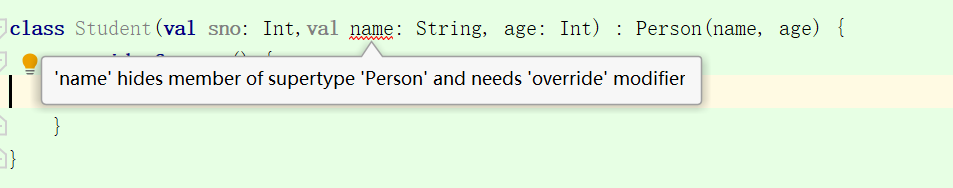
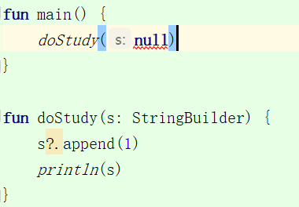

# 一、Kotlin特性

末尾没有分号


## 一、变量和函数

1. KT没有基本类型，全部是类，基本类型首字母大写表示。
2. 申明变量用 val 和 var 表示，val 对应 final


### 1.申明

```kotlin
fun largeNumber(num1:Int ,num2:Int):Int{
    val a=o;
    return max(num1,num2)
}
```

`（）`中表示需要的参数，括号后的`:`表示返回的类型，返回为空可以不写


### 2.修饰符

| 修饰符    | JAVA                             | KT                 |
| --------- | -------------------------------- | ------------------ |
| public    | 所有类可见                       | 所有类可见（默认） |
| private   | 当前类可见                       | 当前类可见         |
| protected | 当前类、子类、同一路径下的类可见 | 当前类、子类可见   |
| default   | 同一路径下的类可见（默认）       |                    |
| internal  |                                  | 同一模块下的类可见 |


## 一、类和对象

1. `：`表示继承或实现关系，变量放左边，类型放右边
2. 判断对象是否相等，可以直接使用`==`


### 1.构造函数

#### 1.1 主构造函数

主构造函数直接写在类的后面

```kotlin
class Person(val name: String,  age: Int) {
    val age = age
    fun say() {
        println(name + age)
    }
}
```

如果需要初始化的操作，写在init{}中：

```kotlin
open class Person(val name: String, var age: Int) {
    init {
        age=18
    }
}
```

如果是对变量赋值的情况，也可以直接用等号赋默认值，并且有默认值，创建对象时可以不写该字段

```kotlin
open class Person(val name: String, var age: Int = 17) {
    constructor() : this("张三")
    open fun say() {
        println(name + age)
    }
}
```


创建对象：

```kotlin
fun main() {
    val person = Person()
    println(person.say()) //张三17
}
```


#### 1.2 次构造函数

次构造函数用constructor标识

```kotlin
open class Person(val name: String, age: Int) {
    constructor() : this("张三", 18)	 //次构造函数，会调用主构造函数并设置默认值
}
```

因为主构造函数可以设置默认值，所以次构造函数基本没有什么用。。


#### 1.3 函数默认值

当函数有默认值时，构造可以不传值。但是如果是第一个参数为默认值，第二个参数需要传值的时候，可以使用以下方式：

```kotlin
fun main() {
    add(num2 = 1);//指定传递给某个参数
}

fun add(num1: Int = 2, num2: Int) {
    println(num1 + num2)
}
```


### 2.继承

如果要继承，则父类的`class`前需要申明` open`，继承的方法` fun` 前也要申明`open`

```kotlin
open class Person(val name: String,  age: Int) {
    val age = age
    open fun say() {
        println(name + age)
    }
}
```

因为子类要实现父类的构造函数，所以需要把对应的参数传入Person()中。

子类继承的方法用override 标注

```kotlin
class Student(val sno: Int, name: String, age: Int) : Person(name, age) {
    override fun say() {
    }
}
```

并且父类构造中如果申明了val，子类不能再申明相同字段为val 或 var ，否则会和父类的参数造成冲突




### 3.只有次构造函数的情况

子类没有主构造函数，只有次构造函数，次构造函数又调用了父类的构造。所以这时候继承的Person也没有加括号。

```java
open class Person(val name: String, var age: Int) {
}

class Student : Person {
    constructor(name: String, age: Int) : super(name, age)
}
```


### 4.接口

基本和 JAVA 一致，也跟在`:`后，因为接口没有构造，所以不需要加`()`

```kotlin
interface Study {
    fun readBook()
}

class Student : Study {
    override fun readBook() {
        print("readBook..")
    }

    constructor(name: String, age: Int) : super(name, age)
}
```


接口中的默认方法：

```kotlin
interface Study {
    fun readBook(){
        print("readBook!")
    }
}
```

> 默认方法不强制被子类实现


### 5.特殊的类


#### 1.数据类

data关键字标识的，会自动生成equlas、hashCode、toString

```kotlin
data class Cellphone(var brand: String, var price: Double) {

}
```


1.不能和open关键字同时使用

2.主构造函数的参数必须申明 var 或 val


#### 2.单例类

object 关键字，因为是单例类，所以不需要构造，也不需要括号。

单例类中的方法能够直接通过类名调用。

```java
object SingleTon{
    fun test(){
        print("hello")
    }
}

//调用     SingleTon.test()
```


如果在某个非单例的类中需要把某个方法设置为直接调用的方法，就需要 companion object 关键字

```kotlin
class Util {
    fun do1() {
        println("do1...")
    }

    companion object {
        fun do2() {
            println("do2...")
        }
    }
}
```

> companion object 会创建一个伴生类，且仅有一个


#### 3.内部类

inner关键字修饰

```kotlin
inner class ViewHolder(val fruitImage: ImageView, val fruitName: TextView)
```


#### 4.密封类

有以下案例：确定接口的返回值时，使用when判断，还需要写else，所以可以用密封类

```kotlin
interface Result
class Success(val msg: String) : Result
class Failure(val msg: String) : Result

fun getResult(result: Result) = when (result) {
    is Success -> println(result.msg)
    is Failure -> println(result.msg)
    else -> print("error")
}

fun main() {
    val success = Success("成功")
    getResult(success)
}
```

> 此时如果再新增Result的子类，getResult() 就会走else的分支


```kotlin
sealed class Result
class Success(val msg: String) : Result()
class Failure(val msg: String) : Result()

fun getResult(result: Result) = when (result) {
    is Success -> println(result.msg)
    is Failure -> println(result.msg)
}

fun main() {
    val success = Success("成功")
    getResult(success)
}
```

> 此时如果再新增Result的子类，getResult() 就会报错，必须增加子类的分支


### 6.特殊方法

#### 1.静态方法

就是在 companion object 方法中加入注解即可

```kotlin
    companion object {
        @JvmStatic
        fun do2() {
            println("do2...")
        }
    }
```


#### 2.顶层方法

没有定义在任何类中的方法，直接写在kt的文件中的，比如main()

```kotlin
package com.example.guolintest

fun main() {
    
}
```


这类方法能在任何位置被调用，也不用创建实例，自动被编译成静态方法。Java可以通过调用静态方法的方式调用顶层方法。


## 三、语法糖

### 1.推导机制


#### 1.函数和变量的推导

类在定义时如果有初始值，不用设置类型：

```kotlin
fun main(){
    val a=10
}
```


函数只有一行时，直接用等号连接

```kotlin
fun largeNumber(num1:Int ,num2:Int):Int= max(num1,num2)
```


又因max函数确定返回值，可以省略Int

```kotlin
fun largeNumber(num1: Int, num2: Int) = max(num1, num2)
```


#### 2.函数式推导

匿名内部类的写法，用object关键字替代了new对象的使用：

```kotlin
   Thread(object :Runnable{
       override fun run() {
           println("启动")
       }
   }).start()
```


当接口中只有一个方法时，可以省略该方法和object对象

```kotlin
    Thread(Runnable {
        println("启动")
    }).start()
```


### 2.集合

#### 1.List和Set集合

不可变集合的创建：

```kotlin
val list= listOf("apple","banana")
```


可变集合的创建：

```kotlin
val list= mutableListOf("apple","banana")
```


遍历：

```kotlin
for (s in list) {
    println(s)
}
```

> set  集合使用  setOf  即可，其他不变


#### 2.Map集合

存取数据：

```kotlin
    val map= HashMap<String ,Int>()
    map["Apple"]=1
    map["Bnana"]=2
    map["Origin"]=3


    val value=map["Apple"]
    println(value)
```


mapOf方式创建集合：

```kotlin
val map = mapOf("Apple" to 1, "Bnana" to 2)
```

> to 是infix函数


遍历：

```kotlin
val map = mapOf("Apple" to 1, "Bnana" to 2)
for (entry in map) {
    println(entry)
}

for ((fruit, number) in map) {
    println(fruit + "=" + number)
}
```


### 3.Lambda表达式

lambda格式：

```kotlin
{参数名1：类型，参数名2：类型 ->  函数体}
```

并以最后一行作为函数的返回值


以集合为例，maxBy函数接收一个lambda表达式，

```kotlin
	val list = listOf("Apple", "Banana", "Orange")
	
    println(list.maxBy({ fruit: String -> fruit.length }))
```


lambda是最后一个参数时，可以移到小括号的外面：

```kotlin
  list.maxBy() { fruit: String -> fruit.length }
```

只有一个参数时，小括号也能省略：

```kotlin
  list.maxBy { fruit: String -> fruit.length }
```

因为类型推导机制，可以不用写参数类型。当只有一个参数时，可以用it代替

```kotlin
  val maxBy = list.maxBy { it.length }
```


### 4.集合函数API

#### 1.filter

过滤集合

```kotlin
    val list = listOf("Apple", "Banana", "Orange")
    val newList = list.filter { it.length > 5 }
    println(newList) 	//[Banana, Orange]
```


#### 2.any

判断集合是否存在某个值符合条件

```kotlin
    val list = listOf("Apple", "Banana", "Orange")
    val result = list.any { it.length > 5 }
    println(result)		//true 
```


#### 3.all

集合中是否所有元素都符合条件

```kotlin
    val list = listOf("Apple", "Banana", "Orange")
    val result = list.all { it.length > 5 }
    println(result)  //false
```


### 5.判空工具

kt把空指针提前到了编译期，如果出现空指针会报错：




如果想要该类型为空，在类型后面加个 `?`即可：

```kotlin
fun doStudy(s: StringBuilder?) {
    println(s)
}
```


##### ?. 操作符

为空，则不执行，不为空则执行

```kotlin
fun doStudy(s: StringBuilder?) {
    s?.append(1)
    println(s)
}
```


##### ?: 操作符

左边表达式结果不为空返回结果，否则返回右边

```kotlin
fun doStudy(s: StringBuilder?) {
    val res = s ?: 1 
    println(res)
}
```


##### !!. 操作符

断定绝不为空

```kotlin
fun doStudy(s: StringBuilder?) {
    s!!.append(1)
    println(s)
}
```


##### ?= 操作符

用于对全局变量赋空值

```kotlin
    val sb: StringBuilder? = null
```


### 6.延迟初始化

在很多时候，需要一开始对一个变量申明为全局类型，但在指定方法中才进行初始化工作，这样就需要对每个用到的地方进行非空判断。

因此可以使用`lateinit `关键字：

```kotlin
fun main() {
    val test = Test()
    test.p()
}

class Test {
    lateinit var my: My

    fun p() {
        println(my)		//此时如果没有被初始化，程序运行就会报错
    }
}

data class My(var int: Int) {}
```


```kotlin
	//加入判断，如果没有被初始化，那么就进行初始化
	fun p() {
        if (!::my.isInitialized) {
            my = My(1)
        }
        println(my)
    }
```

> :: 变量.isInitialized    用于判断是否初始化操作


### 7.内嵌字符串$

```kotlin
    val name = "张三"
    val age = 18
    println("name =$name,age=$age")		//name =张三,age=18
```


## 四、程序逻辑

### 1.if 和 while

if 带有返回值，其他同 JAVA

while 循环和 JAVA 无区别


### 2.when

when 等同 swich ，但更加强大，也带返回值

格式：匹配值 -> { 执行逻辑 }    

> 只有一行时，执行逻辑的括号可以省略

```kotlin
fun getScore(name: String) = when (name) {
    "Tom" -> 86
    "jack" -> 86
    else -> 0
}

fun getScore(name: String) = when {
    name.startsWith("M") -> 100
    name == "Tom" -> 86
    name.equals("jack") -> 88
    else -> 0
}
```


另外，还支持类型匹配

```kotlin
fun checkNum(num:Number){
    when(num){
        is Int -> print("Int")
        is Double -> print("Double")
    }
}
```

> is 相当于 JAVA 的 instanceof


### 3.for in

区间：

0..10  		  左右开区间 [0,10]

0 until 10	左开右闭 [0,10)

step 			步长

downTo 	 降序


## 五、高阶函数

###  1.let

全局非空判断函数，接收一个lambda表达式，配合`?.`操作符使用。

作用于需要对同一个对象多次判空处理的时候用，因为翻译出的文件里，对每一个?. 都做了判断，let函数可以节省代码量

```kotlin
fun doStudy(s: StringBuilder?) {
    s?.let {
        s.append(1)
        s.append(2)
        println(s)
    }
}
```


### 2.with

接收两个参数：1为对象，2为lambda表达式

作用：在lambda中提供参数1的上下文对象，并把最后一行作为返回值

```kotlin
    val sb = StringBuilder()
    val result = with(sb) {
        "value"
    }
    println(result)  //value
```

```kotlin
    val sb = StringBuilder()
    val result = with(sb) {
        append("a")
        toString()
    }
    println(result)  //a
```


### 3.run

只接收一个lambda表达式，通过对象调用，作用和with一致

```kotlin
    val result =  StringBuilder().run {
        append("a")
        toString()
    }
    println(result)
```


### 4.apply

和run函数作用相同，但不指定返回值，返回调用者对象本身

```kotlin
    val result =  StringBuilder().apply {
        append("a")
    }
    println(result)
```


# 二、UI界面


### 1.菜单

新建res/menu/main.xml:

```xml
<?xml version="1.0" encoding="utf-8"?>
<menu xmlns:android="http://schemas.android.com/apk/res/android">
    <item
        android:id="@+id/add"
        android:title="add" />

    <item
        android:id="@+id/remove"
        android:title="remove" />
</menu>
```


MA:

```kotlin
	//创建菜单，menuInflater实际是调用父类的getMenuInflater()
	override fun onCreateOptionsMenu(menu: Menu?): Boolean {
        menuInflater.inflate(R.menu.main, menu)
        return true
    }

	//菜单的点击事件
    override fun onOptionsItemSelected(item: MenuItem): Boolean {
        when (item.itemId) {
            R.id.add -> Toast.makeText(this, "add", Toast.LENGTH_SHORT).show()
            R.id.remove -> Toast.makeText(this, "remove", Toast.LENGTH_SHORT).show()
        }
        return true
    }
```


### 2.when配合的点击事件

```kotlin
class MainActivity : AppCompatActivity(), View.OnClickListener {
    override fun onClick(v: View?) {
        when (v?.id) {
            R.id.tv->{}
        }
    }
}
```


### 3.Dialog

```kotlin
        AlertDialog.Builder(this).apply {
            setTitle("Dialog")
            setMessage("Content")
            setCancelable(false)
            setPositiveButton("OK"){dialog, which ->  }
            setNegativeButton("Cancel"){dialog, which ->  }
            show()
        }
```


### 4.ListView

子项布局 fruit_item.xml：

```xml
<?xml version="1.0" encoding="utf-8"?>
<LinearLayout xmlns:android="http://schemas.android.com/apk/res/android"
    android:layout_width="match_parent"
    android:layout_height="60dp"
    android:orientation="horizontal">

    <ImageView
        android:id="@+id/fruitImage"/>

    <TextView
        android:id="@+id/fruitName"/>
</LinearLayout>
```


自定义的适配器：

```kotlin
class FruitAdapter(activity: Activity, val resourceId: Int, data: List<Fruit>) :
    ArrayAdapter<Fruit>(activity, resourceId, data) {

    //内部类，减少findView的次数
    inner class ViewHolder(val fruitImage: ImageView, val fruitName: TextView)

    //getView()会在每个子项滚动到屏幕内时被调用
    //convertView用于将之前加载好的布局缓存，以便复用，所以可以对其判断提升加载效率
    override fun getView(position: Int, convertView: View?, parent: ViewGroup): View {
        val view: View
        val viewHolder: ViewHolder
        if (convertView == null) {
            view = LayoutInflater.from(context).inflate(resourceId, parent, false)
            val fruitImage: ImageView = view.findViewById(R.id.fruitImage)
            val fruitName: TextView = view.findViewById(R.id.fruitName)
            viewHolder = ViewHolder(fruitImage, fruitName)
            view.tag = viewHolder //把ViewHolder存储在view的tag中
        } else {
            view = convertView
            viewHolder = view.tag as ViewHolder //取出view的tag，强转为ViewHolder
        }

        val fruit = getItem(position)
        if (fruit != null) {
            viewHolder.fruitImage.setImageResource(fruit.imageId)
            viewHolder.fruitName.text = fruit.name
        }
        return view
    }
}
```


MA：（布局就一个listview）

```kotlin
class MainActivity : AppCompatActivity() {
    private val fruitList = ArrayList<Fruit>()

    override fun onCreate(savedInstanceState: Bundle?) {
        super.onCreate(savedInstanceState)
        setContentView(R.layout.activity_main)
        //初始化数组内容
        repeat(20) {
            fruitList.add(Fruit("Apple", R.mipmap.ic_launcher))
        }

        //指定adpter
        val adapter = FruitAdapter(this, R.layout.fruit_item, fruitList)
        listview.adapter = adapter

        //设置点击事件
        listview.setOnItemClickListener { parent, view, position, id ->
            val fruit = fruitList[position]
            Toast.makeText(this, fruit.name, Toast.LENGTH_SHORT).show()
        }
        
        //没有用到的参数可以使用_指定
        listview.setOnItemClickListener { _, _, position, _ ->
            val fruit = fruitList[position]
            Toast.makeText(this, fruit.name, Toast.LENGTH_SHORT).show()
        }
    }
}
```


### 5.RecyclerView

依赖：

```
    implementation 'androidx.recyclerview:recyclerview:1.1.0'
```


xml的内容基本不变，FruitAdapter：

```kotlin
class FruitAdapter(val fruitList: List<Fruit>) : RecyclerView.Adapter<FruitAdapter.ViewHolder>() {
    //内部类，减少findView的次数
    inner class ViewHolder(view: View) : RecyclerView.ViewHolder(view) {
        val fruitImage: ImageView = view.findViewById(R.id.fruitImage)
        val fruitName: TextView = view.findViewById(R.id.fruitName)
    }

    override fun onCreateViewHolder(parent: ViewGroup, viewType: Int): ViewHolder {
        val view = LayoutInflater.from(parent.context).inflate(R.layout.fruit_item, parent, false)
        //点击事件
        val viewHolder = ViewHolder(view)
        viewHolder.itemView.setOnClickListener {
            val fruit = fruitList[viewHolder.adapterPosition]
            Toast.makeText(parent.context, "你点了子项 ${fruit.name}", Toast.LENGTH_SHORT).show()
        }
        return viewHolder
    }

    override fun onBindViewHolder(holder: ViewHolder, position: Int) {
        val fruit = fruitList[position]
        holder.fruitImage.setImageResource(fruit.imageId)
        holder.fruitName.text = fruit.name
    }

    override fun getItemCount() = fruitList.size
}
```


MA:

```kotlin
class MainActivity : AppCompatActivity() {
    private val fruitList = ArrayList<Fruit>()

    override fun onCreate(savedInstanceState: Bundle?) {
        super.onCreate(savedInstanceState)
        setContentView(R.layout.activity_main)
        //初始化数组内容
        repeat(20) {
            fruitList.add(Fruit("Apple", R.mipmap.ic_launcher))
        }

        //指定adpter
        val layoutManager = LinearLayoutManager(this)
        rv.layoutManager = layoutManager
        val adapter = FruitAdapter(fruitList)
        rv.adapter = adapter
    }
}
```


# 三、四大组件


## 一、Activity


### 1.跳转

```kotlin
    val intent = Intent(this, Main2Activity::class.java)
    intent.putExtra("data", "data")
    startActivity(intent)
```


接收值：

这里的原理跟getIntent()是一样的。log中使用`?:`赋予默认值0，防止为空

```kotlin
    val stringExtra = intent.getStringExtra("data")
    Log.e("data", stringExtra ?: "0")
```


### 2.接收返回值

```kotlin
	val intent = Intent(this, Main2Activity::class.java)
    intent.putExtra("data", "data")
    startActivityForResult(intent, 1)
```

> 参数较多时可以使用apply函数简化


设置返回值：

```kotlin
        val intent = Intent()
        intent.putExtra("data", "return")
        setResult(Activity.RESULT_OK, intent)
        finish()
```


接收返回值：

```kotlin
   override fun onActivityResult(requestCode: Int, resultCode: Int, data: Intent?) {
        super.onActivityResult(requestCode, resultCode, data)
        when (requestCode) {
            1 -> if (resultCode == Activity.RESULT_OK) {
                val stringExtra = data?.getStringExtra("data1")
                Log.d("data", "return is $stringExtra")
            }
        }
    }
```


## 二、Fragment

活动调用碎片：

```kotlin
class BlankFragment : Fragment() {

    override fun onCreateView(inflater: LayoutInflater, container: ViewGroup?, savedInstanceState: Bundle?): View? {
        return inflater.inflate(R.layout.fragment_blank, container, false)
    }

    fun p(){
        println("hello")
    }
}
```


MA:

```xml
    <fragment
        android:id="@+id/frag"
        android:name="com.example.guolintest.BlankFragment"/>
```

```kotlin
    val fragment = frag as BlankFragment
    fragment.p()
```


碎片调活动：

```kotlin
    if (activity!=null){
        val mainActivity=activity as MainActivity
        mainActivity.p()
    }
```


