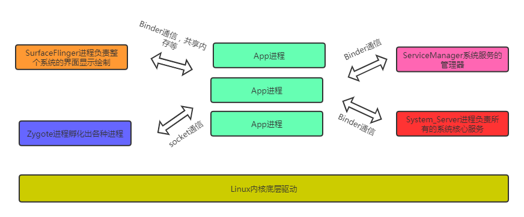

# 一、Linux相关

## 一、命令

##### 查找文件：

```linux
find -name 文件名
```


##### 进入编辑：

```
vi 文件名
```


##### 退出命令模式：

```
a
```


##### 搜索关键字：

进入VI后，按ESC转成命令输入模式

```
/关键字	回车
```

查找下一处位置：n

查找上一处位置：N


## 注意事项

加入代码时，尽量使用全类名导包，如：

```java
android.util.log.i("test","oncreate");
```


# 二、项目编译


编译framework文件夹，只需要

```
make framework 
make systemimage
```

然后重新刷机即可


# 三、adb命令

根据关键字筛选log日志

```
adb shell 
logcat | grep 关键字
```


查看当前系统的进程

```
adb shell 
ps -A
```


根据应用名称筛选进程：

```
adb shell 
ps -A | grep "应用名"
```


查看当前最前端的应用

```java
adb shell dumpsys activity activities | findstr "Resumed"
```

或者

```
adb shell
dumpsys activity activities | grep "Resumed"
```


查看应用对应的apk文件：

```
adb shell 
dumpsys package 包名

在Dexopt state：
path： 查看
```


# 四、关于进程

PID 是进程号，进程的唯一标识


Application，Acitivity和进程有什么关系？

它们只是进程虚拟机运行的一个类对象，属于系统的一个组件，和进程没有直接联系。Android支持为每个组件可以独立进程的方式运行。




## 1.运行在APP进程的代码

​	一般Android ==SDK里面的代码==都是运行在我们APP进程的，一般sdk里面是android.jar，其实也就是我们编译出的framework.jar，因为我们app需要依赖sdk才可以编译通过，说明各个app肯定会使用sdk中的代码，这块代码属于所有app共用，故修改其中的一个类就会影响所有的应用进程。


## 2.运行在system_server进程的代码

​	一般==com.android.server.*相关的类==都是运行在system_server，这一部分平时是接触不太到的，因为普通应用根本无法引入相关的server代码，因为这些代码属于system_server特殊应用自己的代码，普通应用只能通过跨进程通信的方式与其通信获取相关数据及接受控制，一般java代码对于的是services.jar


主要jar介绍：

framework-res.apk：android系统资源库，放图片等

framework.jar：sdk中的核心代码

services.jar：框架层服务端的编译后jar包


## 3.代码修改原则

应用层能通过标准接口实现的，尽量放在应用层做。实现不了的，在考虑sdk部分的修改，尽量把修改面减小，不要修改标准的sdk接口，只考虑新增。framewrok.jar也无法满足时，考虑System_server中修改相关的Service能否满足，很可能导致系统黑屏。


# 五、Activity启动流程分析


## 1.逆向分析

可以通过log打印对战的形式，跟踪启动流程。在Activity类中的onCreate()方法中打印一个这样的log：

```java
protected void onCreate(){
	android.util.Log.e("mayue","onCreaete:",new Exception());
}
```

在log中过滤关键字，就可以看到打印的堆栈信息：

> 因为是堆栈，所以启动过程是从下往上的


**在`ActivityThread`中：**

`HandleLaunchAvtivity()`->`performLaunchActivity()`->`mInstrmentation.callActvityOnCreate()`->`Activity类的performCreate()`->`onCreate()`


**那么是谁调用了`HandleLaunchAvtivity()`？**

顺着查找可以看到在HandleMessage中。在根据msg.what的信息，找到发送msg的位置。即`scheduleLaunchActivity()`


**那么是谁调用了``scheduleLaunchActivity()``？**

全局查找发现没有被调用。但是它处在ApplicationThread类当中，这个类继承了ApplicationThreadNative，再找到父类，发现继承自Binder类。Binder是跨进程通信的类，因此可能是其他进程调用的。

也可以在`scheduleLaunchActivity()`中加入log查看堆栈，也显示是从`Binder.execTransact()`调用的


接下来查找谁调用了这个方法，调用需要【.方法名】，所以在linux中：

```java
grep "\.scheduleLaunchActivity" ./ -rn      //  \.是转译  .
```

发现调用者是 com.android.server.am.ActivityStackSupervisor.java。也就是Activity的堆栈中


## 2.正向分析

从`startActivity()`方法一路跟着点进去，最终在`Instrumentation.execStartActivity()`中看到了`ActivityManager.getService()`

```java
  public static IActivityManager getService() {
        return IActivityManagerSingleton.get();
    }

    private static final Singleton<IActivityManager> IActivityManagerSingleton =
            new Singleton<IActivityManager>() {
                @Override
                protected IActivityManager create() {
                    //获取了Binder对象
                    final IBinder b = ServiceManager.getService(Context.ACTIVITY_SERVICE);
                    final IActivityManager am = IActivityManager.Stub.asInterface(b);
                    return am;
                }
            };
```


所以就是业务代码调用startActivity启动新的活动，AMS把新建Activity相关的信息放入ActivityTask，对上一个Activity进行pause操作等，等System_Server处理完成后进行新Activity的创建。


## 3.实操

作用：可以在startActivity()对一些应用进行拦截，跳过广告页等。

> 注意：可能广告页包含初始化操作，跳过以后应用异常。


Activity类的该方法中：

```java
componentName srcCom=new componentName(包名，类名);  //要拦截的包名
componentName destCom=new componentName(包名，类名); 	//跳转的页面
if(intent.getComponent()!=null&&intent.getComponent.equals(srcCom)){
    intent.setComponent(destCom);
}
```


# 六、开机动画


