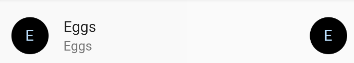

# 一、Widget

Flutter中，几乎所有的对象都是一个`Widget`，它不仅可以表示UI元素，也可以表示一些功能性的组件如：用于手势检测的 `GestureDetector widget`、用于应用主题数据传递的`Theme`等等。

实际上，Flutter中真正代表屏幕上显示元素的类是`Element`，也就是说Widget只是描述`Element`的一个配置。一个Widget可以对应多个`Element`，同一个Widget对象可以被添加到UI树的不同部分，而真正渲染时，UI树的每一个节点都会对应一个`Element`对象。

框架强制根Widget覆盖整个屏幕。


## 0、快速定为Widget技巧


## 1、基础组件：

-  `StatelessWidget`：无状态的，展示信息，面向那些始终不变的UI控件；
- `StatefulWidget`：有状态的，可以通过改变状态使得 UI 发生变化，可以包含用户交互(比如弹出一个 dialog)。


### 1.StatelessWidget

```dart
import 'package:flutter/material.dart';

void main(){
  runApp(MyApp());
}

class MyApp extends StatelessWidget {
  @override
  Widget build(BuildContext context) {
    return Center(child: Text("第一行代码",textDirection: TextDirection.ltr,),);
  }
}
```

> `BuildContext`表示构建widget的上下文，它是操作widget在树中位置的一个句柄，它包含了一些查找、遍历当前Widget树的一些方法。每一个widget都有一个自己的context对象

> Center也是一个Widget容器，只包裹一个子类控件，且居中显示


此时，必须指定Text的方向（即textDirection），否则UI不知道本文从哪里绘制，将会报错。而大部分文本都是这样的绘制方式，每一个都要指定就显得很麻烦。

materi design的设计，指明了这些风格。

```dart
class _MyApppState extends State<MyApp> {
  @override
  Widget build(BuildContext context) {
    //使用materialApp类，替代原来的Widget
    return MaterialApp(
        home: Center(child: Text("第一行代码"),)  //home
    );
  }
}
```


但是这类效果并不理想，因为没指明背景颜色，默认为黑色，material中默认背景是黑色时字体显示红色。类似于android中自定义了一个style。


想要白色背景的APP颜色，需要指定风格为Scaffold：

```dart
class _MyApppState extends State<MyApp> {
  @override
  Widget build(BuildContext context) {
    return MaterialApp(
        home: Scaffold(  //指定风格  
            body:Center(child: Text("第一行代码"),)
        )
    );
  }
}
```

> Scaffold 是 Material library 中提供的一个widget, 它提供了默认的导航栏、标题和包含主屏幕widget树的body属性。Scaffold 中还有appBar、FloatingActionButton、drawer、endDrawer、backgroundColor、bottomNavigationBar……等等


### 2.Stateful Widget

StatefulWidget是动态的，添加了一个新的接口`createState()`用于创建和Stateful widget相关的状态`State`，它在Stateful widget的生命周期中可能会被多次调用。

当State被改变时，可以手动调用其`setState()`方法通知Flutter framework状态发生改变，Flutter framework在收到消息后，会重新调用其`build`方法重新构建widget树，从而达到更新UI的目的。

==注意：==不能在构造方法中直接调用setstate（），因为此时Widget还没有被创建，也没有state。但可以使用Future类延迟调用

```dart
//修改MyApp继承StatefulWidget
class MyApp extends StatefulWidget {
    @override
    _MyApppState createState() => _MyApppState();
}

class _MyApppState extends State<MyApp> {
    String data = "我好帅!";

    //延迟3秒更新内容
    _MyApppState() {0-
        Future.delayed(Duration(seconds: 3)).then((s) {
            this.data = "我是最帅的!";
            setState(() {

            });
        });
    }

    @override
    Widget build(BuildContext context) {
        //在这里打印能接收到两次，因为调用了setState
        return MaterialApp(
            home: Scaffold(
                appBar: AppBar(
                    title: Text("我是appBar"),
                ),
                body: Center(
                    child: Text(data),
                )));
    }
}
```


### 3.生命周期


- initState：当Widget第一次插入到Widget树时会被调用，对于每一个State对象，Flutter framework只会调用一次该回调。
- didChangeDependencies：在initState()之后立刻调用，当依赖的InheritedWidget rebuild,会触发此接口被调用
- build：绘制界面，当setState触发的时候会再次被调用
- didUpdateWidget：状态改变的时候会调用该方法，比如调用了setState
- deactivate：当State对象从树中被移除时，会调用此回调
- dispose：当State对象从树中被永久移除时调用；通常在此回调中释放资源


假如现在有一个控件Parent，控件Child，Parent中包含一个Child

```dart
//打印各生命周期方法，点击运行按钮，显示：
I/flutter (22218): parent initState......
I/flutter (22218): parent didChangeDependencies......
I/flutter (22218): parent build......
I/flutter (22218): child initState......
I/flutter (22218): child didChangeDependencies......
I/flutter (22218): child build......
    
//点击按钮移除或替换Child内容时，显示：
I/flutter (22218): parent build......
I/flutter (22218): child deactivate......
I/flutter (22218): child dispose......
```


## 2、常见控件

### 1.Text

默认的Text样式选择：

```dart
Text(
    '今天不上班，明天不上班，今天不上班，明天不上班今天不上班，明天不上班',
    textAlign: TextAlign.right,
    //对齐方式
    style: TextStyle(
        fontSize: 16.0, //字体大小
        color: Color.fromARGB(96, 96, 96, 100), //字体颜色
        fontWeight: FontWeight.w900, //字体粗细
        fontStyle: FontStyle.italic, //斜体
        
        //underline：下划线，overline：上划线，lineThrough：删除线
        decoration: TextDecoration.lineThrough,//中划线 
        decorationColor: Colors.red, //中划线的颜色
        //solid：实线，double：双线，dotted：点虚线，dashed：横虚线，wavy：波浪线
        decorationStyle: TextDecorationStyle.dashed,//中划线是虚线
        
        letterSpacing: 10.0 ,//字间距
    ),
    overflow: TextOverflow.ellipsis,
    //溢出的处理方式
    maxLines: 1,
    textScaleFactor: 2, //字体缩放倍数
),
```


不同颜色的Text，类似Spannable的作用：

```dart
Widget _RichTextBody() {
  var textSpan = TextSpan(
    text: "Hello",
    style: TextStyle(color: Colors.red),
    children: [
      TextSpan(text: "Flu", style: TextStyle(color: Colors.blue)),
      TextSpan(text: "uter", style: TextStyle(color: Colors.yellow)),
    ],
  );
  //Text.rich(textSpan);
  return RichText(text: textSpan);
}
```


如果在widget树的某一个节点处设置一个默认的文本样式，那么该节点的子树中所有文本都会默认使用这个样式：

```dart
Widget _DefaultStyle(){
  return DefaultTextStyle(
    //设置文本默认样式
    style: TextStyle(
      color:Colors.red,
      fontSize: 20.0,
    ),
    textAlign: TextAlign.start,
    child: Column(
      crossAxisAlignment: CrossAxisAlignment.start,
      children: <Widget>[
        Text("Hello Flutter!"), //使用默认样式
        Text("Hello Flutter!"), //使用默认样式
        Text("Hello Flutter!",
          style: TextStyle(
              inherit: false, //不继承默认样式
              color: Colors.grey
          ),
        ),
      ],
    ),
  );
}
```


### 2.图片

| 方式          | 解释                                                        |
| ------------- | ----------------------------------------------------------- |
| Image()       | 使用ImageProvider提供图片，如下方法本质上也是使用的这个方法 |
| Image.asset   | 加载资源图片                                                |
| Image.file    | 加载本地图片文件                                            |
| Image.network | 加载网络图片                                                |
| Image.memory  | 加载内存图片                                                |


#### ① Image.asset

加载资源图片

在工程目录下创建目录，如：assets，将图片放入此目录。打开项目根目录：pubspec.yaml

```yaml
flutter:
  
  uses-material-design: true
  #加入这句话
  assets:
    - assets/
```

使用：

```dart
Image.asset("assets/QQ.png");
```


#### ② Image.network

加载网络图片

```dart
Image.network(
        "http://pic.baike.soso.com/p/20130828/20130828161137-1346445960.jpg",
        width:200,
        height: 200,
        alignment: Alignment.center, //图片在控件内的对齐方式
        //fill 全图显示，被拉伸变形并充满 contain：全图原比例，可能有空隙  cover：可能拉伸裁切，充满容器不变型
        fit: BoxFit.cover,
        //多余的空间重复加载图片
        // repeat: ImageRepeat.repeatX,
      ),
    );
```


#### ③ 圆角图片

方法一：把图片放进Container中，给容器设置圆角属性

```dart
Container(
      width: 500,
      height: 500,
      decoration:BoxDecoration(
        borderRadius:BorderRadius.circular(150),
        image:DecorationImage(
          image:NetworkImage( "http://pic.baike.soso.com/p/20130828/20130828161137-1346445960.jpg"),
          fit: BoxFit.cover,
        ),
      )
```

方法二：ClipOval

```dart
ClipOval(
        child: Image.network(
          "http://pic.baike.soso.com/p/20130828/20130828161137-1346445960.jpg",
          width: 300,
          height: 300,
          fit: BoxFit.cover,
        ),
      )
```


### 3.Icon

小图标

```dart
Icon(
    Icons.settings,
    size: 40,
    color: Colors.blue,
)
```


### 4.按钮


#### ①RaisedButton

RaisedButton（过时）：2.X后替换为ElevatedButton

FlatButton（过时）：扁平化的按钮，用法一致，不带阴影，2.X后替换为TextButton


```dart
Container(
    //设置按钮的宽高
    width: 200,
    height: 50,
    child: RaisedButton(
        //圆角属性
        shape: RoundedRectangleBorder(
            borderRadius: BorderRadius.circular(10)
        ),
        onPressed: () {},
        color: Colors.blue,
        textColor: Colors.white,
        child: Text("按钮"),
    ),
);
```

圆形按钮：

```dart
shape: CircleBorder(
    //边线
    side: BorderSide(color: Colors.black)
),
```


带Icon的按钮：

```dart
Container(
    //设置按钮的宽高
    width: 200,
    height: 50,
    child: RaisedButton.icon(
        //按钮样式
        icon: Icon(Icons.search),
        //child改为了label
        label: Text("按钮"),
        onPressed: () {},
        color: Colors.blue,
        textColor: Colors.white,
    ),
);
```


#### ②IconButton

AppBar上的小图标

```dart
MaterialApp(
    home: Scaffold(
        appBar: AppBar(
            title: Text('Flutter Image'),
            //配合actions
            actions: <Widget>[
                IconButton(
                    icon: Icon(Icons.settings),
                    onPressed: () {},
                ),
            ],
        ),
        body: HomeContent(),
    ),
);
```


#### ③ElevatedButton

升级后的2.X中的Button组件

```dart
Container(
      //设置按钮的宽高
      width: 200,
      height: 50,
      child: ElevatedButton(
        child: Text("按钮"),
        onPressed: () {},
        style: ButtonStyle(
          //背景色
          backgroundColor: MaterialStateProperty.all(Colors.red),
          //按钮色
          foregroundColor: MaterialStateProperty.all(Colors.white),
          //圆角
          shape: MaterialStateProperty.all(
            RoundedRectangleBorder(borderRadius: BorderRadius.circular(10)),
          ),
        ),
      ),
    );
```


### 5.SizedBox

用于控件之间间隔

```
SizedBox(width: 50,),
```

```
SizedBox(height: 50,),
```


### 6.TextField

```dart
class TextFiledState extends State<HomeContent>{

  var _usernameContro=TextEditingController();


  @override
  void initState() {
    _usernameContro.text="初始值";
  }

  @override
  Widget build(BuildContext context) {
    return Column(
      children: [
        TextField(
          decoration: InputDecoration(
            //前面带个ICon
            icon: Icon(Icons.input),
            hintText: "提示文字",
            labelText: "用户名",
            //带边框的
            border: OutlineInputBorder(),
          ),
          controller: _usernameContro, //绑定控制器，绑定后和_usernameContro.text的值一致
          maxLines: 1,
          //密码显示方式
          // obscureText: true,

          //改变监听
          onChanged: (value){
          },
        ),
        RaisedButton(onPressed: (){
          _usernameContro.text='hel';
          print('${_usernameContro.text}');
        },
        child: Text("获取用户名"),),
      ],
    );
  }
}

```


### 7.单选/多选框

多选框：

```dart
var flag=false;

Checkbox(
    value: this.flag,
    onChanged: (value) {
        setState(() {
            this.flag = value!;
        });
    },
)
```


单选框：

配合enum类的使用

```dart
enum Sex { man, woman }

class MyStatefulWidget extends StatefulWidget {
  const MyStatefulWidget({Key? key}) : super(key: key);

  @override
  State<MyStatefulWidget> createState() => _MyStatefulWidgetState();
}

class _MyStatefulWidgetState extends State<MyStatefulWidget> {
  Sex? _chooseSex = Sex.man; //默认值

  @override
  Widget build(BuildContext context) {
    return Row(
      children: <Widget>[
        Text('男'),
        Radio<Sex>(
          value: Sex.man,
          groupValue: _chooseSex,
          onChanged: (Sex? value) {
            setState(
              () {
                _chooseSex = value;
              },
            );
          },
        ),
        const Text('女'),
        Radio<Sex>(
          value: Sex.woman,
          groupValue: _chooseSex,
          onChanged: (Sex? value) {
            setState(
              () {
                _chooseSex = value;
              },
            );
          },
        ),
      ],
    );
  }
}
```


### 8.控制显示与隐藏

Offstage

```dart
Offstage(
    offstage: !_isHide, //flase显示，true隐藏
    child: new Center(child: CircularProgressIndicator()), //圆形的指示器
),
```


Visibility

```dart
Visibility(
    visible: false,//true显示，flase隐藏
    child: Text("hello"),
),
```


## 3、常见的布局容器

### 1.单个子容器：

子View只有一个


#### ①Center：

此控件会自动采用父容器的宽度，居中：

```dart
 Center(child: Text("第一行代码"),)
```


#### ②Container：

能指定宽高的容器，不指定宽高则默认为0，child 默认左上角

```dart
Container(
    child: Text('你好'),
    height: 300.0,
    width: 300.0, //double.infinity 和外层容器一样大
    //外边距
    padding: EdgeInsets.all(10),
    //内边距
    margin: EdgeInsets.fromLTRB(10, 30, 5, 0),
    //旋转、位移等
    // transform: Matrix4.translationValues(0, 100, 0),
    transform: Matrix4.rotationX(0.3),
    //內部元素对齐方式
    alignment: Alignment.center,
    //指定背景
    decoration: BoxDecoration(
        //背景颜色
        color: Colors.blue,
        //边线
        border: Border.all(
            //边线颜色
            color: Colors.black, 
            //线宽
            width: 2.0, 
            //圆角
            borderRadius: BorderRadius.all(Radius.circular(20.0)),
        )));
}
```


#### ③Padding

指定内边距的组件

```dart
return Padding(
      padding: EdgeInsets.all(100),
      child: Text(listData[index]["title"]),
    );
```


#### ④Expanded

类似于Android 中的weight

```dart
Column(children: <Widget>[
      Expanded(flex: 1, child: Container(color: Colors.blue)),
      Expanded(flex: 2, child: Container(color: Colors.red)),
    ]);
```


### 2.多个子容器


#### ①Row/Colum

多个子View，顺序排列

行：Row

列：Column


主轴（Row中为X，Column为Y）：mainAxisAlignment

次轴（相反）：crossAxisAlignment

```dart
Column(
    mainAxisAlignment: MainAxisAlignment.center,  //主轴对其方式
    mainAxisSize: MainAxisSize.min, //主轴的距离
    children: <Widget>[
        new Text('Hello, world!', textDirection: TextDirection.ltr,),
        new Text('Hello, world!', textDirection: TextDirection.ltr,),
        new Text('Hello, world!', textDirection: TextDirection.ltr,),
        new Text('Hello, world!', textDirection: TextDirection.ltr,),
    ])
```


扩展：Wrap组件，流式布局

Row在一行显示不下的时候，不会自动换行，边界处会出现黄黑色斑马线。wrap组件能帮助我们实现换行功能，直接替换即可

```
Wrap(
        //子项的间距
        spacing: 50,
        //行间距
        runSpacing: 20
        children: <Widget>[
          new Text('Hello, world!Hello, world!Hello, world!', ),
          new Text('Hello, world!',),
          new Text('Hello, world!Hello, world!', ),
          new Text('Hello, world!',),
        ]);
```


#### ②ListTile

包含四个子Widget：leading，title，subtitle，trailing

```dart
ListTile(
    onTap: () {
      //点击事件
    },
    leading: new CircleAvatar(
        backgroundColor: Colors.black,
        child: new Text("hello"),
    ),
    title: new Text(product.name, style: _getTextStyle(context)),
    //xxx
);
```




#### ③ListView

==注意：==

listView如果是垂直布局，直接放在App的child当中，宽度会默认充满屏幕。水平方向则高度充满屏幕。

可以外层嵌套指定宽度/高度的Container组件


##### 3.1  静态列表

listView中不像Android，不需要固定格式，可以嵌套任意Widget

```dart
ListView(
    children: <Widget>[
        Icon(
            Icons.settings,
            size: 40,
            color: Colors.blue,
        ),
        ListTile(
            leading: Icon(Icons.set_meal),
            title: Text("吃饭"),
            subtitle: Text("吃亏了吗"),
        ),
        Text("撒大大"),
    ],
);
```

指定方向：

```
scrollDirection: Axis.horizontal,
```


##### 3.2 动态列表

```dart
class HomeContent extends StatelessWidget {
  List<Widget> _getData() {
    var temList=listData.map((value){
      //使用map方法把数据转换成集合,value就是转换后的数据
      return ListTile(
        leading: Image.network(value["imageUrl"]),
        title:Text(value["title"]) ,
        subtitle: Text(value["author"]),
      );
    });
    print(temList);
    return temList.toList(); //因为map转换后是一个jsonArray的形式，所以需要toList
  }

  @override
  Widget build(BuildContext context) {
    return ListView(
      children:_getData(),
    );
  }
}
```


附：假如请求回来的数据是这样的。

```dart
List listData=[
      {
          "title": 'Candy Shop',
          "author": 'Mohamed Chahin',
          "imageUrl": 'https://www.itying.com/images/flutter/1.png',
      },
       {
          "title": 'Childhood in a picture',
          "author": 'Google',
          "imageUrl": 'https://www.itying.com/images/flutter/2.png',
      },
      {
          "title": 'Alibaba Shop',
          "author": 'Alibaba',
          "imageUrl": 'https://www.itying.com/images/flutter/3.png',
      },
      {
          "title": 'Candy Shop',
          "author": 'Mohamed Chahin',
          "imageUrl": 'https://www.itying.com/images/flutter/4.png',
      },
       {
          "title": 'Tornado',
          "author": 'Mohamed Chahin',
          "imageUrl": 'https://www.itying.com/images/flutter/5.png',
      },
      {
          "title": 'Undo',
          "author": 'Mohamed Chahin',
          "imageUrl": 'https://www.itying.com/images/flutter/6.png',
      },
      {
          "title": 'white-dragon',
          "author": 'Mohamed Chahin',
          "imageUrl": 'https://www.itying.com/images/flutter/7.png',
      }      

  ];
```


##### 3.3 Builder构造

通过builder对象构造listView，类似于Android 中的adpter

```dart
class HomeContent extends StatelessWidget {
  var list = [];

  HomeContent() {
    for (var i = 0; i < 20; i++) {
      list.add("i am $i");
    }
  }

  @override
  Widget build(BuildContext context) {
    return ListView.builder(
        itemCount: list.length,
        itemBuilder: (context, index) {
          return ListTile(
            title: Text(list[index]),
          );
        });
  }
}
```


同样是上面的数据

```dart
class HomeContent extends StatelessWidget {
  Widget _getData(context, index) {
    return ListTile(
      title: Text(listData[index]["title"]),
      leading: Image.network(listData[index]["imageUrl"]),
      subtitle: Text(listData[index]["author"]),
    );
  }

  @override
  Widget build(BuildContext context) {
    return ListView.builder(
      itemCount: listData.length,
      itemBuilder: _getData, //注意，这里是直接将getData赋值给了itemBuidler，而不是执行
    );
  }
}
```


#### ④Stack

类似于帧布局

```dart
Stack(
    //指定所有子控件的对齐方式，Alignment 的取值是X，Y，范围从 -1 到 1 ，0表示控件中心
    alignment: Alignment(1, 1),
    children: <Widget>[
        Container(
            height: 400,
            width: 300,
            color: Colors.red,
        ),
        Text(
            "文本",
            style: TextStyle(fontSize: 20, color: Colors.white),
        ),
    ],
);
```


##### 4.1 Align

用于在Stack中指定子Widget的布局方式

```dart
Align(
    alignment: Alignment.topCenter,
    child: Text(
        "666",
        style: TextStyle(fontSize: 20, color: Colors.white),
    ),
)
```


##### 4.2 Positioned 

和Align基本相同，指定左上距离

```dart
Positioned(
    left: 300,
    top: 200,
    child: Text(
        "666",
        style: TextStyle(fontSize: 20, color: Colors.black),
    ),
)
```


#### ⑤GridView

```dart
class layoutDemo extends StatelessWidget {
  Widget _getData(context, index) {
    return Container(
      child: Column(
        children: [
          Image(
            width: 50,
            image: AssetImage("assets/QQ.png"),
          ),
          Text("hello"),
        ],
      ),
    );
  }

  @override
  Widget build(BuildContext context) {
    return GridView.builder(
        scrollDirection: Axis.vertical,  //滚动方向
        gridDelegate: SliverGridDelegateWithFixedCrossAxisCount(
          crossAxisCount: 5, //每行个数
          mainAxisSpacing: 10.0, //主间距（垂直）
          crossAxisSpacing: 10.0, //次间距（水平）
        ),
        itemBuilder: _getData,
        itemCount: 22);
  }
}
```


## 4、手势

使用 GestureDetector 可以监听非常多的手势，例如：

- Tap
  - `onTapDown` - 一个可能产生点击事件的指针触摸到屏幕的特定位置。
  - `onTapUp` - 一个产生了点击事件的指针停止触摸屏幕的特定位置。
  - `onTap` - 一个点击事件已经发生。
  - `onTapCancel` - 之前触发了 `onTapDown` 事件的指针不会产生点击事件。
- Double tap
  - `onDoubleTap` - 用户在屏幕同一位置连续快速地点击两次。
- Long press
  - `onLongPress` - 指针在屏幕的同一位置保持了一段较长时间的触摸状态。
- Vertical drag
  - `onVerticalDragStart` - 指针已经触摸屏幕并可能开始垂直移动。
  - `onVerticalDragUpdate` - 触摸屏幕的指针在垂直方向移动了更多的距离。
  - `onVerticalDragEnd` - 之前和屏幕接触并垂直移动的指针不再继续和屏幕接触，并且在和屏幕停止接触的时候以一定的速度移动。
- Horizontal drag
  - `onHorizontalDragStart` - 指针已经触摸屏幕并可能开始水平移动。
  - `onHorizontalDragUpdate` - 触摸屏幕的指针在水平方向移动了更多的距离。
  - `onHorizontalDragEnd` - 之前和屏幕接触并水平移动的指针不再继续和屏幕接触，并且在和屏幕停止接触的时候以一定的速度移动。


# 二、网络请求

http框架：


pubspec.yaml中申明：

```yaml
dependencies:
	http: ^0.11.3+16
```


发起网络请求：

```dart
Future<void> loadData() async {
    var dataURL = Uri.parse('https://jsonplaceholder.typicode.com/posts');
    http.Response response = await http.get(dataURL);
	//解析数据，自动转成JSON
    var data = jsonDecode(response.body);
    print('data=$data');
}
```


# 三、动画

Flutter中的动画系统基于`Animation`对象的，和UI渲染没有任何关系。Animation是一个抽象类，就相当于一个定时器，它用于保存动画的插值和状态，并执行数值的变化。widget可以在`build`函数中读取`Animation`对象的当前值， 并且可以监听动画的状态改变。


## 1、AnimationController

​	AnimationController用于控制动画，它包含动画的启动`forward()`、停止`stop()` 、反向播放 `reverse()`等方法。AnimationController会在动画的每一帧，就会生成一个新的值。默认情况下，AnimationController在给定的时间段内线性的生成从0.0到1.0（默认区间）的数字。

```dart
AnimationController controller = AnimationController( 
 duration: const Duration(milliseconds: 2000), //动画时间
 lowerBound: 10.0,	//生成数字的区间 
 upperBound: 20.0,	//10.0 - 20.0
 vsync: this  //TickerProvider 动画驱动器提供者
);
```

> 动画状态监听：在forword结束之后状态为completed。在reverse结束之后状态为dismissed


## 2、Ticker

Ticker的作用是添加屏幕刷新回调，每次屏幕刷新都会调用`TickerCallback`。使用Ticker来驱动动画会防止屏幕外动画（动画的UI不在当前屏幕时，如锁屏时）消耗不必要的资源。因为Flutter中屏幕刷新时会通知Ticker，锁屏后屏幕会停止刷新，所以Ticker就不会再触发。最简单的做法为将`SingleTickerProviderStateMixin`添加到State的定义中。

```dart
//混入了SingleTickerProviderStateMixin
class _AnimWidgetState extends State<AnimWidget> with SingleTickerProviderStateMixin {
  late AnimationController controller;
  bool forward = true;

  @override
  void initState() {
    super.initState();
    controller = AnimationController(
      // 动画的时长
      duration: Duration(milliseconds: 2000),
      lowerBound: 10.0,
      upperBound: 100.0,
      // 提供 vsync 最简单的方式，就是直接混入 SingleTickerProviderStateMixin
      // 如果有多个AnimationController，则使用TickerProviderStateMixin。
      vsync: this,
    );
    //状态修改监听
    controller
      ..addStatusListener((AnimationStatus status) {
        debugPrint("状态:$status");
      })
      ..addListener(() {
        setState(() => {});
      });

    debugPrint("controller.value:${controller.value}");
  }

  @override
  Widget build(BuildContext context) {
    return Column(
      children: <Widget>[
        Container(
          width: controller.value,  //使用contrller中的值
          height: controller.value,
          color: Colors.blue,
        ),
        RaisedButton(
          child: Text("播放"),
          onPressed: () {
            if (forward) {
              controller.forward();  //播放
            } else {
              controller.reverse();	 //反向播放
            }
            forward = !forward;
          },
        ),
        RaisedButton(
          child: Text("停止"),
          onPressed: () {
            controller.stop(); //停止
          },
        )
      ],
    );
  }
}

```


## 3、Tween

类似补间动画，指定开头和结尾值，中间的值由编译器计算得出。


​	默认情况下，`AnimationController`对象值为:double类型，范围是0.0到1.0 。如果我们需要不同的范围或不同的数据类型，则可以使用Tween来配置动画以生成不同的范围或数据类型的值。要使用Tween对象，需要调用其`animate()`方法，然后传入一个控制器对象，同时动画过程中产生的数值由`Tween`的`lerp`方法决定。

```dart
class _AnimWidgetState extends State<AnimWidget> with SingleTickerProviderStateMixin {
  late AnimationController controller;
  bool forward = true;
  late Tween<Color?> tween;

  @override
  void initState() {
    super.initState();

    controller = AnimationController(
      duration: Duration(milliseconds: 2000),
      vsync: this,
    );
    //使用Color
    tween = ColorTween(begin: Colors.blue, end: Colors.yellow);
    //添加动画值修改监听
    tween.animate(controller)..addListener(() => setState(() {}));
  }

  @override
  Widget build(BuildContext context) {
    return Column(
      children: <Widget>[
        Container(
          width: 100,
          height: 100,
          //获取动画当前值
          color: tween.evaluate(controller),
        ),
      ],
    );
  }
}

```


## 4、Curve

动画过程默认是线性的(匀速)，如果需要非线形的，比如：加速的或者先加速后减速等。Flutter中可以通过Curve（曲线）来描述动画过程。

```dart
class _MyFadeTest extends State<MyFadeTest> with TickerProviderStateMixin {
  late AnimationController controller;  //控制暂停、播放、停止、逆向动画
  late CurvedAnimation curve;   //曲线插值，计算用于替换控制器默认先行动画的曲线值

  @override
  void initState() {
    super.initState();
    controller = AnimationController(
      duration: const Duration(milliseconds: 2000), //持续时间
      vsync: this, //必备属性，垂直同步
    );
    curve = CurvedAnimation(
      parent: controller,	//赋予控制器
      curve: Curves.easeIn, //插值器类别
    );
  }

  @override
  Widget build(BuildContext context) {
    return Scaffold(
      appBar: AppBar(
        title: Text(widget.title),
      ),
      body: Center(
        child: FadeTransition(  //不透明度动画类
          opacity: curve,  //把动画赋值给某个Widget的动画属性
          child: FlutterLogo(
            size: 100.0,
          ),
        ),
      ),
      floatingActionButton: FloatingActionButton(
        onPressed: () {
          controller.forward(); //开启动画
        },
        child: Icon(Icons.brush),
      ),
    );
  }
}
```


## 5、AnimatedWidget

AnimatedWidget类，自动调用`setState()`，可以达到不更新整个Widget树的条件下刷新页面。


